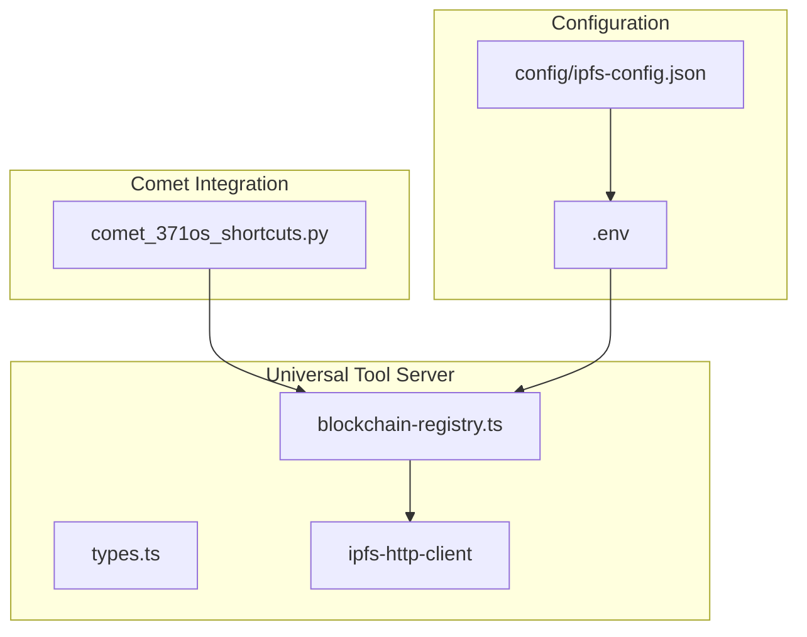
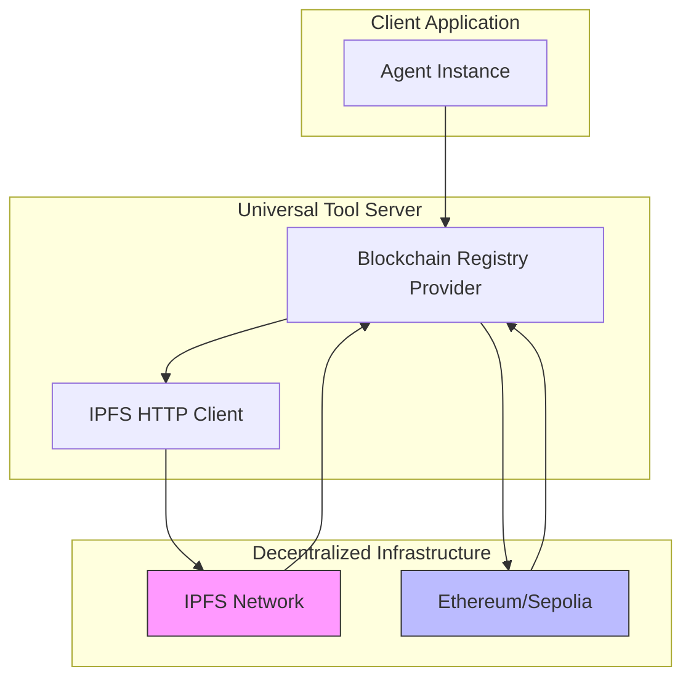
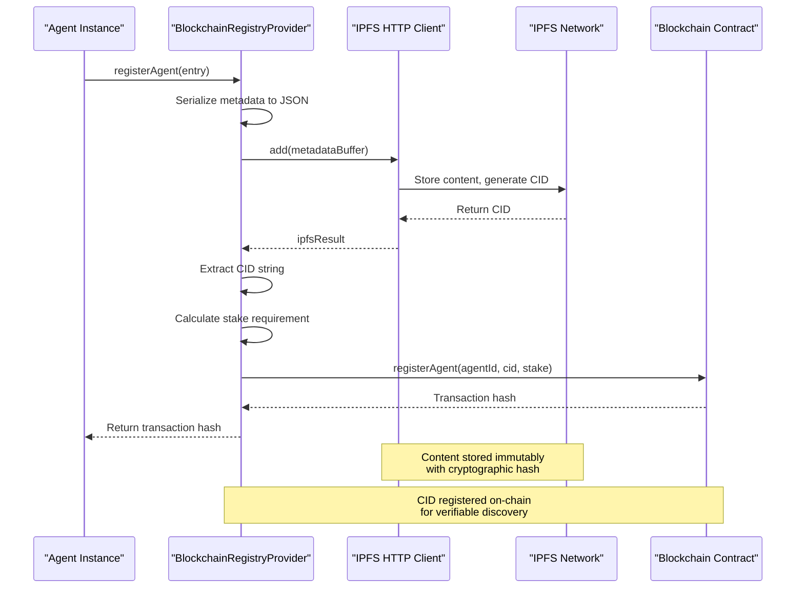
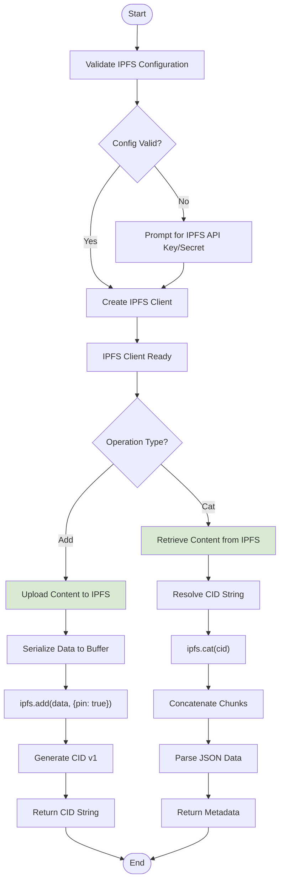
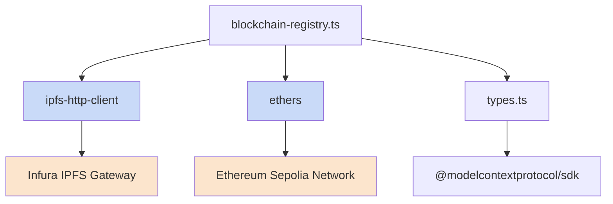

# Decentralized Storage (IPFS)

<cite>
**Referenced Files in This Document**   
- [comet_371os_shortcuts.py](file://371-os/src/minds371/comet/comet_371os_shortcuts.py)
- [blockchain-registry.ts](file://packages/elizaos-plugins/universal-tool-server/src/blockchain-registry.ts)
- [types.ts](file://packages/elizaos-plugins/universal-tool-server/src/types.ts)
- [package.json](file://packages/elizaos-plugins/universal-tool-server/package.json)
- [IMPLEMENTATION_GUIDE.md](file://IMPLEMENTATION_GUIDE.md)
- [quick-start.sh](file://scripts/quick-start.sh)
- [quick-start.ps1](file://scripts/quick-start.ps1)
</cite>

## Table of Contents
1. [Introduction](#introduction)
2. [Project Structure](#project-structure)
3. [Core Components](#core-components)
4. [Architecture Overview](#architecture-overview)
5. [Detailed Component Analysis](#detailed-component-analysis)
6. [Dependency Analysis](#dependency-analysis)
7. [Performance Considerations](#performance-considerations)
8. [Troubleshooting Guide](#troubleshooting-guide)
9. [Conclusion](#conclusion)

## Introduction
The Decentralized Storage implementation using IPFS within the Universal Tool Server provides an immutable, content-addressed storage system for agent code, configuration files, and execution artifacts. This system ensures verifiable deployment by storing content on IPFS and referencing the Content Identifiers (CIDs) in blockchain registries. The integration enables trustless agent discovery, reputation management, and economic coordination without centralized authorities. Agent metadata, capabilities, and deployment information are stored immutably on IPFS, while cryptographic hashes (CIDs) are registered on-chain for verification and discovery.

## Project Structure
The project structure reveals a modular architecture with clear separation between core system components, agent implementations, and decentralized infrastructure services. The Universal Tool Server's IPFS integration is primarily located in the `packages/elizaos-plugins/universal-tool-server` directory, while the core IPFS interaction logic is implemented in the `371-os/src/minds371/comet` module.



**Diagram sources**
- [blockchain-registry.ts](file://packages/elizaos-plugins/universal-tool-server/src/blockchain-registry.ts)
- [comet_371os_shortcuts.py](file://371-os/src/minds371/comet/comet_371os_shortcuts.py)

**Section sources**
- [blockchain-registry.ts](file://packages/elizaos-plugins/universal-tool-server/src/blockchain-registry.ts)
- [comet_371os_shortcuts.py](file://371-os/src/minds371/comet/comet_371os_shortcuts.py)

## Core Components
The core components of the decentralized storage system include the Blockchain Registry Provider, IPFS HTTP client integration, and the type definitions that structure agent metadata. The system uses IPFS for immutable storage of agent metadata and configuration, while leveraging blockchain smart contracts to register and verify CIDs. When an agent is registered, its complete metadata is stored on IPFS, and the resulting CID is recorded on-chain along with the agent's identifier and stake amount. This creates a verifiable link between the agent's on-chain identity and its off-chain metadata.

**Section sources**
- [blockchain-registry.ts](file://packages/elizaos-plugins/universal-tool-server/src/blockchain-registry.ts)
- [types.ts](file://packages/elizaos-plugins/universal-tool-server/src/types.ts)

## Architecture Overview
The architecture implements a hybrid decentralized storage model where IPFS provides content-addressed, immutable storage for agent artifacts, while blockchain smart contracts maintain a registry of CIDs for verification and discovery. This separation of concerns allows for scalable content storage while maintaining cryptographic verification of agent identities and capabilities.



**Diagram sources**
- [blockchain-registry.ts](file://packages/elizaos-plugins/universal-tool-server/src/blockchain-registry.ts)
- [types.ts](file://packages/elizaos-plugins/universal-tool-server/src/types.ts)

## Detailed Component Analysis

### Blockchain Registry Provider Analysis
The Blockchain Registry Provider serves as the primary interface between the Universal Tool Server and the decentralized storage infrastructure. It handles agent registration, discovery, reputation management, and deployment updates by coordinating between IPFS storage and blockchain smart contracts.

#### Class Diagram
```mermaid
classDiagram
class BlockchainRegistryProvider {
-provider : ethers.Provider
-contract : ethers.Contract
-ipfs : IPFSHTTPClient
-registryAddress : string
+registerAgent(entry : AgentRegistryEntry) : Promise~string~
+discoverTools(criteria : DiscoveryCriteria) : Promise~AgentRegistryEntry[]~
+updateReputation(update : ReputationUpdate) : Promise~string~
+updateDeployment(agentId : string, deploymentInfo : Partial~DeploymentInfo~) : Promise~void~
+getNetworkMetrics(timeWindow : string) : Promise~any~
-calculateStakeRequirement(capabilities : AgentCapability[]) : number
-parseTimeWindow(timeWindow : string) : number
}
class AgentRegistryEntry {
+agentId : string
+did : string
+capabilities : AgentCapability[]
+verifiableCredentials : VerifiableCredential[]
+reputation : ReputationScore
+economicTerms : EconomicTerms
+deploymentInfo : DeploymentInfo
}
class AgentCapability {
+toolId : string
+name : string
+description : string
+inputSchema : any
+outputSchema : any
+costModel : CostModel
+permissions : Permission[]
+availability : AvailabilitySchedule
}
BlockchainRegistryProvider --> AgentRegistryEntry : "uses"
BlockchainRegistryProvider --> AgentCapability : "uses"
BlockchainRegistryProvider --> "ipfs-http-client" : "uses"
BlockchainRegistryProvider --> "ethers" : "uses"
```

**Diagram sources**
- [blockchain-registry.ts](file://packages/elizaos-plugins/universal-tool-server/src/blockchain-registry.ts)
- [types.ts](file://packages/elizaos-plugins/universal-tool-server/src/types.ts)

**Section sources**
- [blockchain-registry.ts](file://packages/elizaos-plugins/universal-tool-server/src/blockchain-registry.ts)

#### Agent Registration Sequence
The agent registration workflow demonstrates how content is stored immutably via IPFS and referenced in blockchain registries for verifiable deployment.



**Diagram sources**
- [blockchain-registry.ts](file://packages/elizaos-plugins/universal-tool-server/src/blockchain-registry.ts)

**Section sources**
- [blockchain-registry.ts](file://packages/elizaos-plugins/universal-tool-server/src/blockchain-registry.ts)

### IPFS Integration Analysis
The IPFS integration is implemented through the `ipfs-http-client` library, which provides the interface for content addressing, CID generation, and pinning strategies. The system uses Infura's IPFS gateway by default, with authentication handled through API keys and secrets stored in environment variables.

#### IPFS Operations Flowchart


**Diagram sources**
- [blockchain-registry.ts](file://packages/elizaos-plugins/universal-tool-server/src/blockchain-registry.ts)

**Section sources**
- [blockchain-registry.ts](file://packages/elizaos-plugins/universal-tool-server/src/blockchain-registry.ts)

## Dependency Analysis
The decentralized storage system has well-defined dependencies that enable its core functionality. The primary dependencies include the `ipfs-http-client` for IPFS operations, `ethers` for blockchain interactions, and `@modelcontextprotocol/sdk` for agent communication protocols.



**Diagram sources**
- [package.json](file://packages/elizaos-plugins/universal-tool-server/package.json)
- [blockchain-registry.ts](file://packages/elizaos-plugins/universal-tool-server/src/blockchain-registry.ts)

**Section sources**
- [package.json](file://packages/elizaos-plugins/universal-tool-server/package.json)

## Performance Considerations
The decentralized storage implementation addresses several performance considerations for large-scale deployments. Content availability is ensured through IPFS pinning services and strategic replication. The system uses CID version 1 with base58btc encoding for consistent content addressing across different IPFS implementations. For bandwidth optimization, the system implements lazy loading of agent metadata, retrieving content from IPFS only when needed for discovery or execution. The pinning strategy is configured to automatically pin all added content, ensuring availability while relying on Infura's infrastructure for redundancy. Challenges such as garbage collection are mitigated by the economic model, where agents must maintain a stake to keep their content discoverable, creating a natural mechanism for removing outdated or unused agents.

## Troubleshooting Guide
Common issues in the decentralized storage implementation typically relate to IPFS connectivity, authentication, or blockchain network configuration. When IPFS operations fail, verify that the `IPFS_API_KEY` and `IPFS_API_SECRET` are correctly configured in the `.env` file. Connection issues may also stem from network restrictions or rate limiting on the Infura gateway. For blockchain-related errors, ensure that the `ETHEREUM_RPC_URL` points to a valid node and that the wallet has sufficient funds for transaction fees. When content cannot be retrieved from IPFS, check that the CID is correctly formatted and that the content was successfully pinned during upload. Monitoring tools should track IPFS upload success rates, CID generation latency, and blockchain transaction confirmations to identify performance bottlenecks.

**Section sources**
- [quick-start.sh](file://scripts/quick-start.sh)
- [quick-start.ps1](file://scripts/quick-start.ps1)
- [IMPLEMENTATION_GUIDE.md](file://IMPLEMENTATION_GUIDE.md)

## Conclusion
The Decentralized Storage implementation using IPFS within the Universal Tool Server provides a robust, verifiable system for agent deployment and discovery. By storing agent metadata and configuration files immutably on IPFS and referencing their CIDs in blockchain registries, the system ensures integrity and transparency in agent deployments. The content addressing mechanism using CIDs enables trustless verification of agent artifacts, while the pinning strategies and network integration ensure content availability. The integration with the Comet framework automates IPFS handling during workspace creation, streamlining the deployment workflow. This architecture effectively addresses challenges of content availability, garbage collection, and bandwidth optimization in large-scale deployments through a combination of technical implementation and economic incentives.