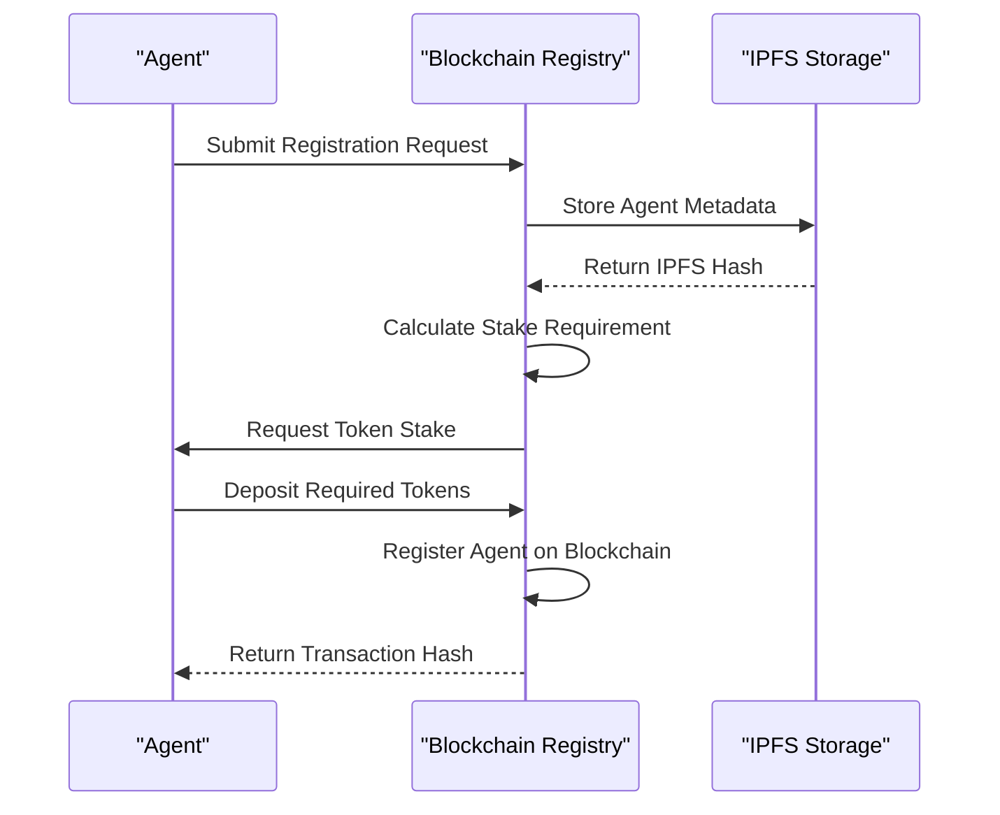
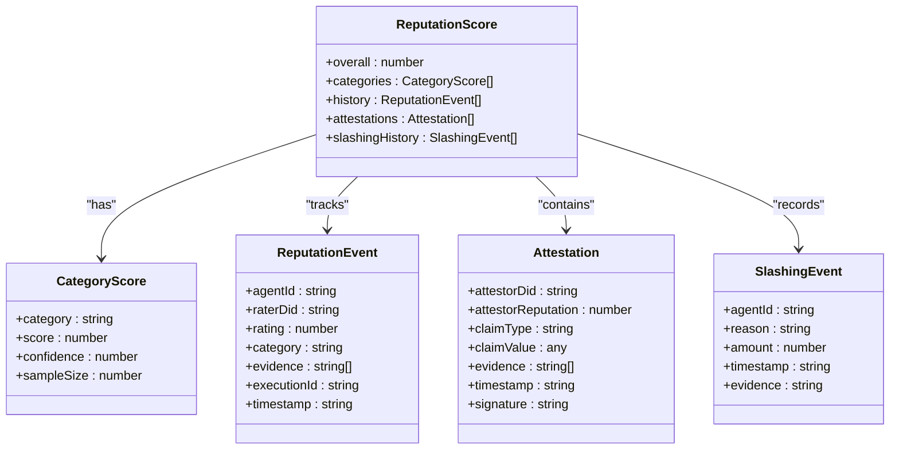
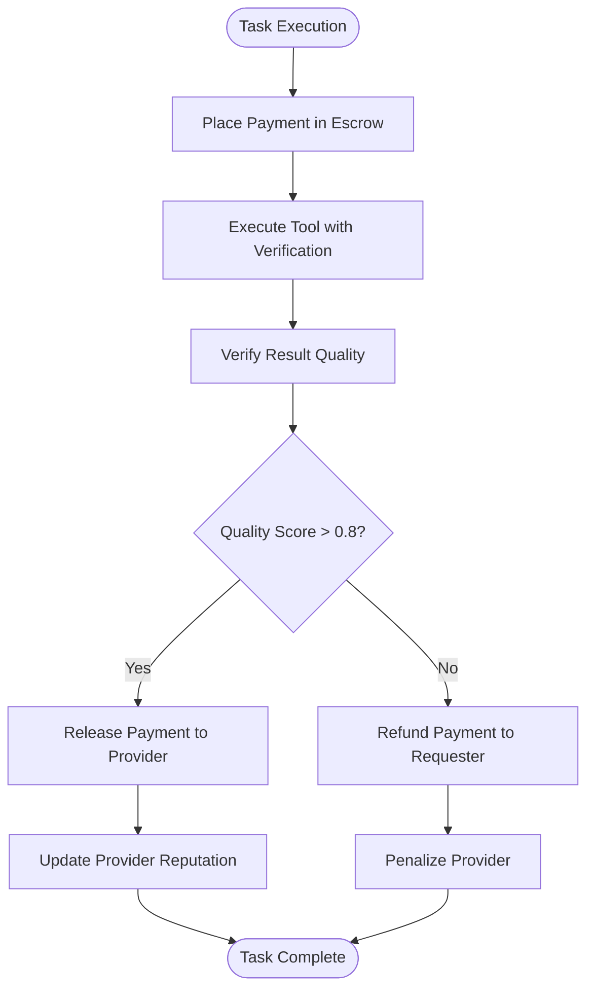

# Economic Incentive Model

<cite>
**Referenced Files in This Document**   
- [blockchain-registry.ts](file://packages/elizaos-plugins/universal-tool-server/src/blockchain-registry.ts#L58-L101)
- [blockchain-registry.ts](file://packages/elizaos-plugins/universal-tool-server/src/blockchain-registry.ts#L181-L232)
- [blockchain-registry.ts](file://packages/elizaos-plugins/universal-tool-server/src/blockchain-registry.ts#L332-L368)
- [types.ts](file://packages/elizaos-plugins/universal-tool-server/src/types.ts#L65-L125)
- [actions.ts](file://packages/elizaos-plugins/universal-tool-server/src/actions.ts#L20-L55)
- [actions.ts](file://packages/elizaos-plugins/universal-tool-server/src/actions.ts#L267-L305)
- [financial_agent.py](file://371-os/src/minds371/agents/utility/financial_agent.py#L0-L9)
- [financial_system.py](file://371-os/src/minds371/financial_system.py)
</cite>

## Table of Contents
1. [Introduction](#introduction)
2. [Staking Mechanism](#staking-mechanism)
3. [Reputation Scoring System](#reputation-scoring-system)
4. [Reward and Penalty Mechanisms](#reward-and-penalty-mechanisms)
5. [Financial Agent Integration](#financial-agent-integration)
6. [DAO Governance and Dispute Resolution](#dao-governance-and-dispute-resolution)
7. [Economic Security Considerations](#economic-security-considerations)

## Introduction
The Economic Incentive Model governs agent behavior and reliability within the Universal Tool Server ecosystem. This model establishes a trustless, decentralized framework where agents stake tokens to register services, earn rewards for successful task execution, and face penalties for poor performance or malicious behavior. The system combines blockchain-based staking, reputation scoring, and DAO governance to create a self-regulating marketplace for agent services.

## Staking Mechanism

The staking mechanism requires agents to deposit tokens on the blockchain when registering their services, establishing skin-in-the-game for performance and trustworthiness. This process ensures that only committed agents participate in the network and provides economic security against malicious actors.



**Diagram sources**
- [blockchain-registry.ts](file://packages/elizaos-plugins/universal-tool-server/src/blockchain-registry.ts#L58-L101)
- [actions.ts](file://packages/elizaos-plugins/universal-tool-server/src/actions.ts#L20-L55)

When an agent registers with the Universal Tool Server, the system calculates a stake requirement based on the agent's capabilities. The `calculateStakeRequirement` function determines the required stake amount using a base stake plus additional requirements for each capability, with a complexity multiplier for high-value capabilities like financial or crypto services.

```typescript
private calculateStakeRequirement(capabilities: AgentCapability[]): number {
  const baseStake = 10; // AKT
  const capabilityStake = capabilities.length * 2; // 2 AKT per capability
  const complexityMultiplier = capabilities.some(cap => 
    cap.name.includes('financial') || cap.name.includes('crypto')
  ) ? 2 : 1;
  
  return baseStake + (capabilityStake * complexityMultiplier);
}
```

The registration process involves storing complete agent metadata on IPFS and registering the hash on-chain with the calculated stake amount. This hybrid approach ensures data availability while maintaining blockchain security for critical verification data.

**Section sources**
- [blockchain-registry.ts](file://packages/elizaos-plugins/universal-tool-server/src/blockchain-registry.ts#L58-L101)
- [actions.ts](file://packages/elizaos-plugins/universal-tool-server/src/actions.ts#L20-L55)

## Reputation Scoring System

The reputation scoring system tracks agent performance across multiple dimensions including successful task completion, response time, and error rates. This multi-faceted approach provides a comprehensive assessment of agent reliability and influences future task allocation.



**Diagram sources**
- [types.ts](file://packages/elizaos-plugins/universal-tool-server/src/types.ts#L65-L125)

The reputation system allows any participant to update an agent's reputation based on completed interactions, user feedback, or automated performance metrics. The `updateReputation` method submits reputation updates to the blockchain with cryptographic proof and evidence linking to verifiable execution results.

```typescript
async updateReputation(update: {
  agentId: string;
  raterDid: string;
  rating: number;
  category: string;
  evidence: string[];
  executionId?: string;
  timestamp: string;
}): Promise<string> {
  const agentIdBytes = ethers.id(update.agentId);
  
  const evidenceHash = ethers.id(JSON.stringify({
    executionId: update.executionId,
    evidence: update.evidence,
    rater: update.raterDid,
    timestamp: update.timestamp
  }));
  
  const rating = Math.min(100, Math.max(0, Math.round(update.rating * 100)));
  
  const wallet = new ethers.Wallet(
    process.env.AGENT_PRIVATE_KEY || ethers.Wallet.createRandom().privateKey,
    this.provider
  );
  
  const contractWithSigner = this.contract.connect(wallet);
  
  const tx = await contractWithSigner.updateReputation(
    agentIdBytes,
    rating,
    evidenceHash
  );
  
  await tx.wait();
  return tx.hash;
}
```

The system calculates overall success rates by analyzing reputation events and slashing incidents, providing a transparent measure of agent reliability that can be used for task allocation decisions.

**Section sources**
- [blockchain-registry.ts](file://packages/elizaos-plugins/universal-tool-server/src/blockchain-registry.ts#L181-L232)
- [actions.ts](file://packages/elizaos-plugins/universal-tool-server/src/actions.ts#L267-L305)

## Reward and Penalty Mechanisms

The reward and penalty mechanisms are tied to staked tokens, creating strong economic incentives for high-performance execution and disincentives for malicious or failed behavior. These mechanisms ensure that agents are rewarded for value creation and penalized for failures.



**Diagram sources**
- [here's the thing.md](file://sotalogic/Claude Sonnet 4/Alignment Review of 371OS_launch Project Plan/here's the thing.md)

The economic terms interface defines the payment models, currencies, and penalty structures for agent services:

```typescript
interface EconomicTerms {
  paymentModel: 'per-call' | 'subscription' | 'compute-time' | 'outcome-based';
  basePrice: number;
  currency: 'AKT' | 'ETH' | 'USDC' | 'native';
  dynamicPricing?: DynamicPricingConfig;
  escrowRequired: boolean;
  slashing?: SlashingConfig;
}

interface CostModel {
  basePrice: number;
  scalingFactors: ScalingFactor[];
  discounts: VolumeDiscount[];
  penalties: PerformancePenalty[];
}

interface ScalingFactor {
  metric: 'complexity' | 'data-size' | 'processing-time' | 'accuracy-requirement';
  multiplier: number;
  threshold?: number;
}
```

Agents can be slashed for malicious or failed behavior, with the severity of penalties determined by the nature of the infraction. The system also provides bonuses for high-performance execution, creating a positive reinforcement loop for reliable agents.

**Section sources**
- [types.ts](file://packages/elizaos-plugins/universal-tool-server/src/types.ts#L65-L125)

## Financial Agent Integration

The financial agent serves as the primary interface between the Universal Tool Server's economic system and the blockchain registry. This utility agent manages financial transactions, stake management, and reward distribution according to strict security protocols.

```python
from ...financial_system import FinancialAgent as BaseFinancialAgent

class FinancialAgent(BaseFinancialAgent):
    """
    A utility agent for financial tasks.
    This agent can be extended with more specialized financial capabilities.
    """
    def __init__(self):
        super().__init__()
```

The financial agent interacts with the blockchain registry to manage stakes and distribute rewards. When an agent completes a task successfully, the financial agent verifies the result quality and executes the payment release from escrow. For failed tasks, it processes refunds to requesters and applies appropriate penalties to the provider's stake.

The agent follows a security protocol that requires explicit confirmation before executing financial operations, ensuring that all transactions are authorized and compliant with financial guidelines.

**Section sources**
- [financial_agent.py](file://371-os/src/minds371/agents/utility/financial_agent.py#L0-L9)
- [financial_system.py](file://371-os/src/minds371/financial_system.py)

## DAO Governance and Dispute Resolution

DAO governance enables community-driven decision-making for adjusting incentive parameters and handling disputes. This decentralized approach ensures that the economic model evolves according to the needs of the ecosystem participants rather than centralized authorities.

The governance system allows token holders to propose changes to economic parameters such as base stake requirements, slashing thresholds, and reward multipliers. Proposals are voted on by the community, with voting power typically proportional to token holdings or reputation scores.

For dispute resolution, the system provides mechanisms for challenging reputation updates or slashing decisions. Disputes can be escalated to a decentralized arbitration process where multiple trusted agents or human jurors review the evidence and render a decision.

This governance model ensures that the economic incentive system remains fair, transparent, and adaptable to changing conditions in the ecosystem.

## Economic Security Considerations

The economic incentive model incorporates several security measures to protect the integrity of the system:

### Inflation Control
The tokenomics are designed to prevent inflation through controlled token issuance and deflationary mechanisms such as transaction fees and slashing penalties that remove tokens from circulation.

### Stake Thresholds
Minimum stake requirements prevent spam and sybil attacks, with higher thresholds for agents offering high-risk services like financial or cryptographic capabilities.

### Collusion Prevention
The reputation system incorporates multiple independent raters and cryptographic proof of execution to prevent collusion between agents. The system also monitors for patterns of coordinated reputation manipulation.

### Network Metrics Monitoring
The system continuously monitors network performance metrics including:
- Total agents and new registrations
- Interaction volume and success rates
- Slashing incidents and network alerts
- Average latency and performance trends

```typescript
private calculateSuccessRate(reputationEvents: any[], slashingEvents: any[]): number {
  if (reputationEvents.length === 0) return 1.0;
  
  const negativeEvents = slashingEvents.length;
  const totalEvents = reputationEvents.length + negativeEvents;
  
  return Math.max(0, (totalEvents - negativeEvents) / totalEvents);
}
```

These metrics provide early warning signs of potential security issues and help maintain the overall health of the ecosystem.

**Section sources**
- [blockchain-registry.ts](file://packages/elizaos-plugins/universal-tool-server/src/blockchain-registry.ts#L332-L368)