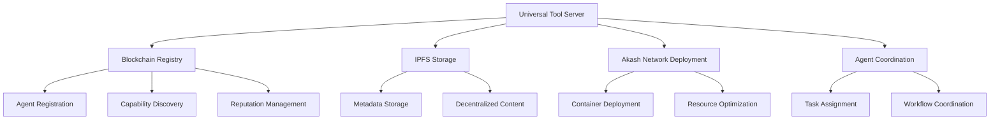
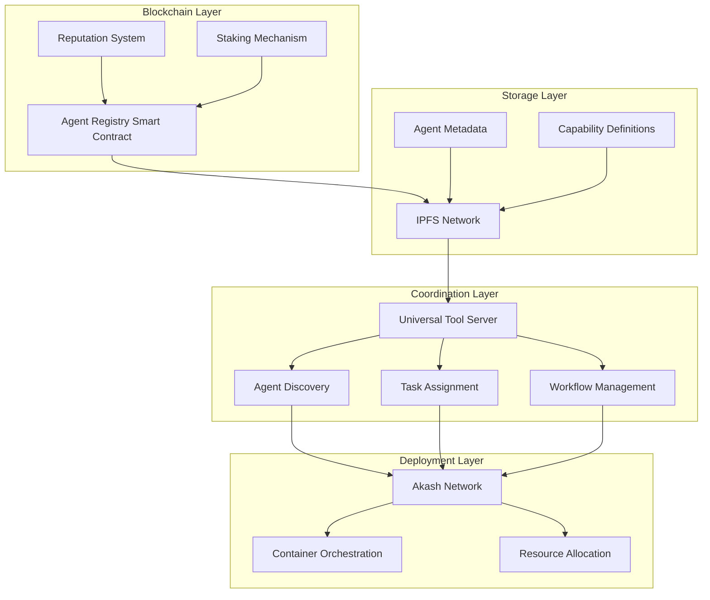
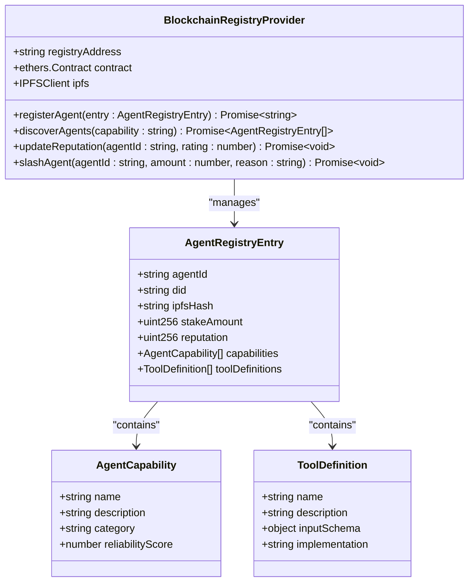
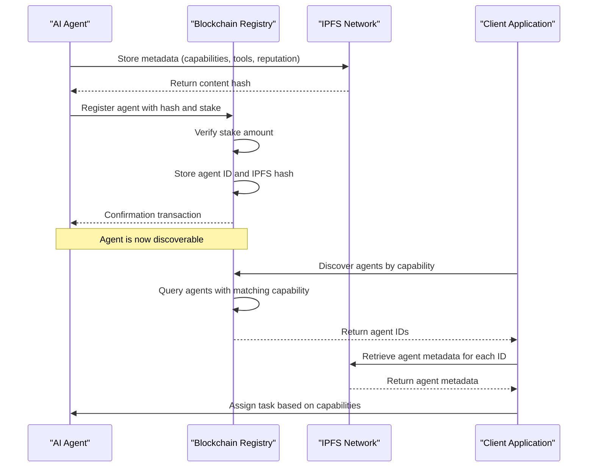
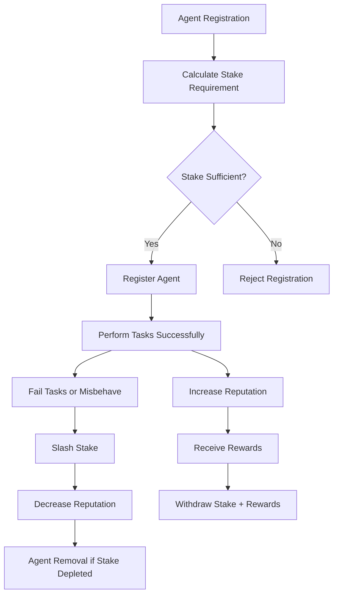
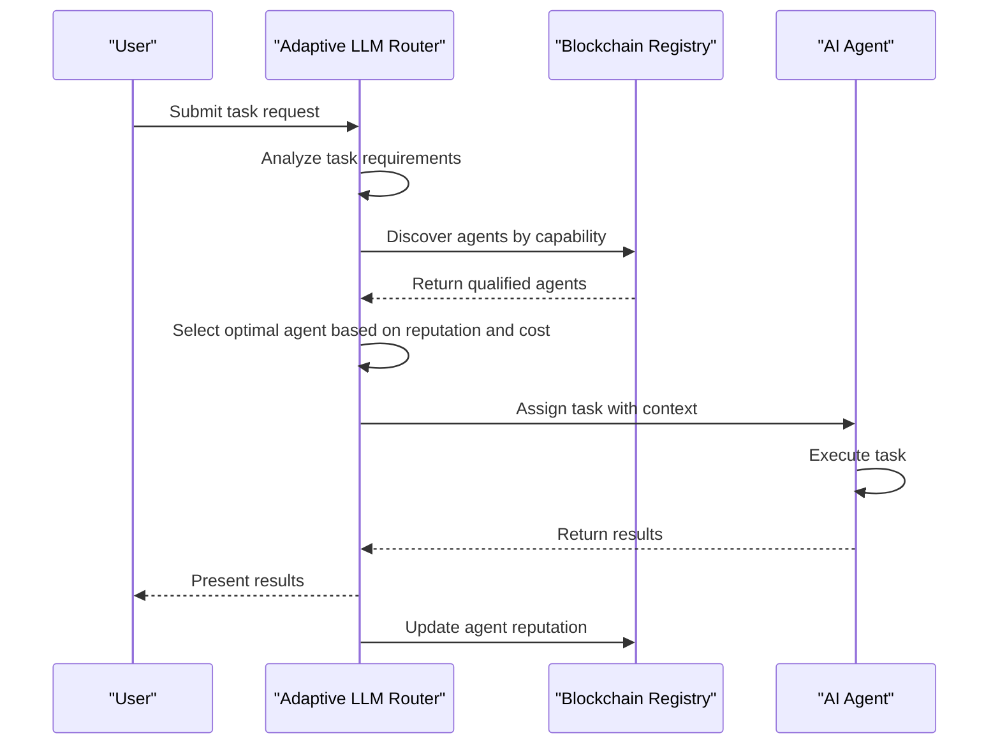
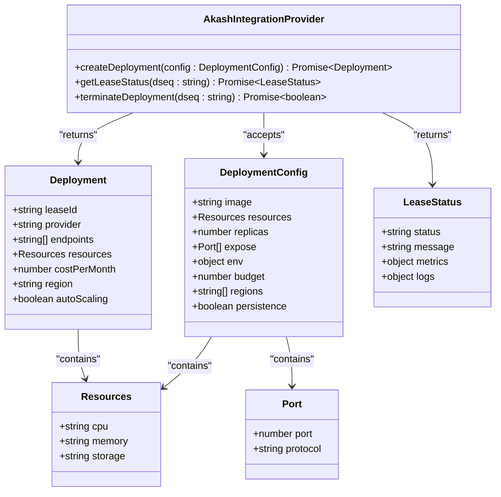
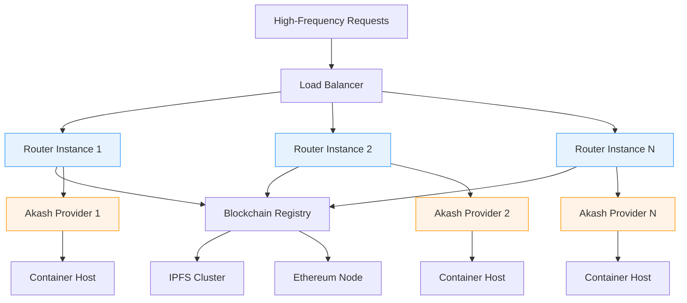
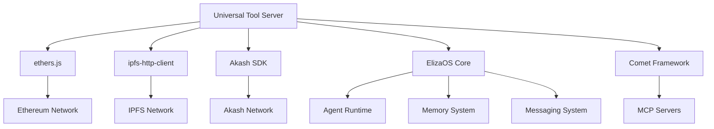
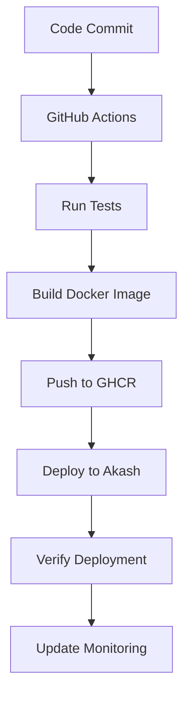

# Universal Tool Server

<cite>
**Referenced Files in This Document**   
- [371-os\docs\architecture\system_architecture.html](file://371-os/docs/architecture/system_architecture.html)
- [packages\elizaos-plugins\universal-tool-server\src\blockchain-registry.ts](file://packages/elizaos-plugins/universal-tool-server/src/blockchain-registry.ts)
- [packages\elizaos-plugins\universal-tool-server\src\actions.ts](file://packages/elizaos-plugins/universal-tool-server/src/actions.ts)
- [371-os\CEO_Agent_Logic.md](file://371-os/CEO_Agent_Logic.md)
- [IMPLEMENTATION_GUIDE.md](file://IMPLEMENTATION_GUIDE.md)
- [GETTING_STARTED.md](file://GETTING_STARTED.md)
- [sotalogic\Claude Sonnet 4\Alignment Review of 371OS_launch Project Plan\now can you create a guide for me .md](file://sotalogic/Claude Sonnet 4/Alignment Review of 371OS_launch Project Plan/now can you create a guide for me .md)
- [scripts\deploy-akash.sh](file://scripts/deploy-akash.sh)
- [deployments\universal-tool-server\deploy.yml](file://deployments/universal-tool-server/deploy.yml)
- [.github\workflows\deploy-uts.yml](file://.github/workflows/deploy-uts.yml) - *Added in commit 50670da9e620a98cb8f7ce446759f5ec98cde42c*
</cite>

## Update Summary
**Changes Made**   
- Added new section on CI/CD pipeline and automated deployment workflow
- Updated infrastructure integration section to include GitHub Actions deployment configuration
- Enhanced deployment patterns section with Akash Network deployment details from deploy.yml
- Added references to new CI/CD workflow file and updated deployment configuration
- Maintained all existing architectural and functional documentation

## Table of Contents
1. [Introduction](#introduction)
2. [Project Structure](#project-structure)
3. [Core Components](#core-components)
4. [Architecture Overview](#architecture-overview)
5. [Detailed Component Analysis](#detailed-component-analysis)
6. [Dependency Analysis](#dependency-analysis)
7. [Performance Considerations](#performance-considerations)
8. [Troubleshooting Guide](#troubleshooting-guide)
9. [CI/CD Pipeline](#cicd-pipeline)
10. [Conclusion](#conclusion)

## Introduction
The Universal Tool Server is a blockchain-based coordination system designed to enable stateless AI agent coordination through decentralized registries and IPFS storage. This system leverages the Comet framework and MCP servers for agent discovery and communication, while implementing a zero-trust security model through Secretless Broker and ACI.dev integration. The architecture incorporates an economic incentive system where agents stake tokens to establish reputation and reliability, enabling trust-minimized operations in a decentralized environment.

## Project Structure
The Universal Tool Server is organized within a comprehensive monorepo structure that follows a feature-based organization pattern. The core functionality resides in the `371-os` directory, with the Universal Tool Server implementation located in `packages/elizaos-plugins/universal-tool-server`. The architecture is designed with clear separation of concerns, organizing components into distinct layers including infrastructure, services, core orchestration, agent ecosystem, and platform integration.



**Diagram sources**
- [371-os\docs\architecture\system_architecture.html](file://371-os/docs/architecture/system_architecture.html)

**Section sources**
- [371-os\docs\architecture\system_architecture.html](file://371-os/docs/architecture/system_architecture.html)

## Core Components
The Universal Tool Server consists of several core components that work together to enable decentralized agent coordination. The blockchain registry serves as the foundation for agent discovery and reputation management, while IPFS provides decentralized storage for agent metadata and capabilities. The Akash Network integration enables cost-optimized container deployment, and the agent coordination system facilitates task assignment and workflow management across distributed agents.

**Section sources**
- [371-os\docs\architecture\system_architecture.html](file://371-os/docs/architecture/system_architecture.html)
- [packages\elizaos-plugins\universal-tool-server\src\blockchain-registry.ts](file://packages/elizaos-plugins/universal-tool-server/src/blockchain-registry.ts)

## Architecture Overview
The Universal Tool Server implements a multi-layer architecture that combines blockchain technology, decentralized storage, and distributed computing to create a robust platform for AI agent coordination. The system enables stateless agent coordination by maintaining agent state and capabilities in decentralized registries, allowing agents to be deployed and scaled independently while maintaining consistent behavior and reputation.



**Diagram sources**
- [371-os\docs\architecture\system_architecture.html](file://371-os/docs/architecture/system_architecture.html)
- [packages\elizaos-plugins\universal-tool-server\src\blockchain-registry.ts](file://packages/elizaos-plugins/universal-tool-server/src/blockchain-registry.ts)

## Detailed Component Analysis

### Blockchain-Based Coordination System
The Universal Tool Server utilizes a blockchain-based registry to enable trustless agent discovery and coordination. This decentralized approach eliminates the need for centralized authorities while providing cryptographic verification of agent capabilities and reputation.



**Diagram sources**
- [packages\elizaos-plugins\universal-tool-server\src\blockchain-registry.ts](file://packages/elizaos-plugins/universal-tool-server/src/blockchain-registry.ts)

**Section sources**
- [packages\elizaos-plugins\universal-tool-server\src\blockchain-registry.ts](file://packages/elizaos-plugins/universal-tool-server/src/blockchain-registry.ts)

### Agent Registration and Discovery
The agent registration process involves storing agent metadata on IPFS and registering the content hash on the blockchain with staking requirements. This creates a verifiable and tamper-proof record of agent capabilities and reputation.



**Diagram sources**
- [packages\elizaos-plugins\universal-tool-server\src\blockchain-registry.ts](file://packages/elizaos-plugins/universal-tool-server/src/blockchain-registry.ts)

**Section sources**
- [packages\elizaos-plugins\universal-tool-server\src\blockchain-registry.ts](file://packages/elizaos-plugins/universal-tool-server/src/blockchain-registry.ts)

### Economic Incentive System
The Universal Tool Server implements an economic incentive system where agents stake tokens to establish reputation and reliability. This staking mechanism aligns agent behavior with system goals and provides a trust-minimized approach to coordination.



**Diagram sources**
- [packages\elizaos-plugins\universal-tool-server\src\blockchain-registry.ts](file://packages/elizaos-plugins/universal-tool-server/src/blockchain-registry.ts)

**Section sources**
- [packages\elizaos-plugins\universal-tool-server\src\blockchain-registry.ts](file://packages/elizaos-plugins/universal-tool-server/src/blockchain-registry.ts)

### Data Flows for Agent Coordination
The Universal Tool Server facilitates complex data flows for agent registration, capability discovery, and task assignment. These flows are designed to be stateless, allowing agents to be deployed and scaled independently while maintaining consistent coordination.



**Diagram sources**
- [371-os\docs\architecture\system_architecture.html](file://371-os/docs/architecture/system_architecture.html)
- [packages\elizaos-plugins\universal-tool-server\src\blockchain-registry.ts](file://packages/elizaos-plugins/universal-tool-server/src/blockchain-registry.ts)

**Section sources**
- [371-os\docs\architecture\system_architecture.html](file://371-os/docs/architecture/system_architecture.html)
- [packages\elizaos-plugins\universal-tool-server\src\blockchain-registry.ts](file://packages/elizaos-plugins/universal-tool-server/src/blockchain-registry.ts)

### Infrastructure Integration
The Universal Tool Server integrates with external blockchain networks and decentralized storage systems to create a robust infrastructure for agent coordination. The Akash Network deployment integration enables cost-optimized container deployment with automatic resource optimization.



**Diagram sources**
- [packages\elizaos-plugins\universal-tool-server\src\actions.ts](file://packages/elizaos-plugins/universal-tool-server/src/actions.ts)

**Section sources**
- [packages\elizaos-plugins\universal-tool-server\src\actions.ts](file://packages/elizaos-plugins/universal-tool-server/src/actions.ts)

### Scalability Considerations
The Universal Tool Server is designed to handle large numbers of agents and high-frequency coordination requests through a combination of decentralized storage, efficient indexing, and optimized query patterns. The architecture supports horizontal scaling of both the coordination layer and the underlying infrastructure.



**Diagram sources**
- [371-os\docs\architecture\system_architecture.html](file://371-os/docs/architecture/system_architecture.html)
- [packages\elizaos-plugins\universal-tool-server\src\actions.ts](file://packages/elizaos-plugins/universal-tool-server/src/actions.ts)

**Section sources**
- [371-os\docs\architecture\system_architecture.html](file://371-os/docs/architecture/system_architecture.html)
- [packages\elizaos-plugins\universal-tool-server\src\actions.ts](file://packages/elizaos-plugins/universal-tool-server/src/actions.ts)

## Dependency Analysis
The Universal Tool Server has a well-defined dependency structure that separates concerns between blockchain interaction, decentralized storage, and infrastructure deployment. The system relies on established libraries for Ethereum and IPFS integration, while maintaining a modular architecture that allows for component replacement and extension.



**Diagram sources**
- [packages\elizaos-plugins\universal-tool-server\src\blockchain-registry.ts](file://packages/elizaos-plugins/universal-tool-server/src/blockchain-registry.ts)
- [packages\elizaos-plugins\universal-tool-server\src\actions.ts](file://packages/elizaos-plugins/universal-tool-server/src/actions.ts)

**Section sources**
- [packages\elizaos-plugins\universal-tool-server\src\blockchain-registry.ts](file://packages/elizaos-plugins/universal-tool-server/src/blockchain-registry.ts)
- [packages\elizaos-plugins\universal-tool-server\src\actions.ts](file://packages/elizaos-plugins/universal-tool-server/src/actions.ts)

## Performance Considerations
The Universal Tool Server is designed with performance and cost optimization as primary considerations. The system achieves significant cost reductions compared to traditional cloud infrastructure, with reported savings of 97.6% (from $500/month to $12/month). The architecture incorporates caching, connection pooling, and circuit breaker patterns to ensure reliable performance under varying loads.

The adaptive LLM routing system optimizes cost by selecting the most appropriate language model for each task based on complexity and budget constraints. The blockchain registry is optimized for efficient capability-based queries, allowing rapid discovery of suitable agents for incoming tasks.

## Troubleshooting Guide
Common issues with the Universal Tool Server typically relate to blockchain registration, IPFS connectivity, or Akash deployment. The following solutions address the most frequent problems encountered during system operation.

**Section sources**
- [IMPLEMENTATION_GUIDE.md](file://IMPLEMENTATION_GUIDE.md)
- [GETTING_STARTED.md](file://GETTING_STARTED.md)

### Issue: Agents not registering in blockchain
```bash
# Check wallet balance
akash query bank balances $(akash keys show main -a)

# Verify contract deployment
npx hardhat verify --network sepolia $REGISTRY_CONTRACT_ADDRESS

# Test contract interaction
npx hardhat console --network sepolia
```

### Issue: Akash deployment failing
```bash
# Check SDL syntax
akash validate deploy.yml

# Verify provider availability
akash query market provider list

# Check account balance
akash query bank balances $(akash keys show main -a)
```

### Issue: IPFS connection problems
```bash
# Test IPFS API
curl -X POST "https://ipfs.infura.io:5001/api/v0/version" \
  -u "${IPFS_API_KEY}:${IPFS_API_SECRET}"
```

### Issue: Agent discovery slow
```bash
# Check IPFS pinning status
curl "https://ipfs.infura.io:5001/api/v0/pin/ls?arg=${CID}"

# Verify blockchain node connectivity
curl ${AKASH_RPC_URL}/health
```

## CI/CD Pipeline
The Universal Tool Server now features an automated CI/CD pipeline for deployment, ensuring consistent and reliable deployments across environments. The pipeline is configured through GitHub Actions and integrates with the Akash Network for container deployment.



**Diagram sources**
- [.github\workflows\deploy-uts.yml](file://.github/workflows/deploy-uts.yml)

**Section sources**
- [.github\workflows\deploy-uts.yml](file://.github/workflows/deploy-uts.yml)
- [deployments\universal-tool-server\deploy.yml](file://deployments/universal-tool-server/deploy.yml)

The CI/CD pipeline automates the entire deployment process from code commit to production deployment. When changes are pushed to the main branch, GitHub Actions triggers the workflow that runs tests, builds the Docker image, pushes it to GitHub Container Registry (GHCR), and deploys to the Akash Network using the deployment configuration.

The deployment configuration specifies the container image, environment variables, exposed ports, and resource requirements for the Universal Tool Server. The Akash deployment profile defines the compute resources (0.25 CPU units, 256Mi memory, 512Mi storage) and pricing (500uakt) for the service.

## Conclusion
The Universal Tool Server represents a significant advancement in AI agent coordination, combining blockchain technology, decentralized storage, and distributed computing to create a robust platform for stateless agent coordination. By leveraging the Akash Network for cost-optimized deployment and implementing a blockchain-based registry for trustless agent discovery, the system enables scalable and reliable coordination of large numbers of AI agents.

The economic incentive system, where agents stake tokens to establish reputation and reliability, creates a self-regulating ecosystem that aligns agent behavior with system goals. This zero-trust architecture, enhanced by Secretless Broker and ACI.dev integration, provides enterprise-grade security while maintaining the flexibility and scalability required for modern AI applications.

The integration of the Comet framework and MCP servers provides a familiar interface for agent discovery and communication, while the blockchain-based universal registry represents the next evolution in this technology, creating a truly decentralized infrastructure for agent-tool coordination. The newly implemented CI/CD pipeline ensures reliable and automated deployments, enhancing the system's operational efficiency and reliability.