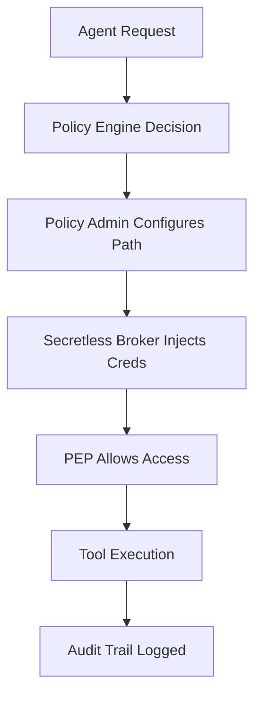
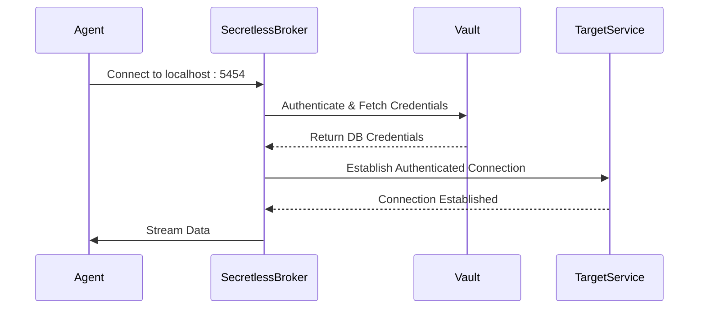
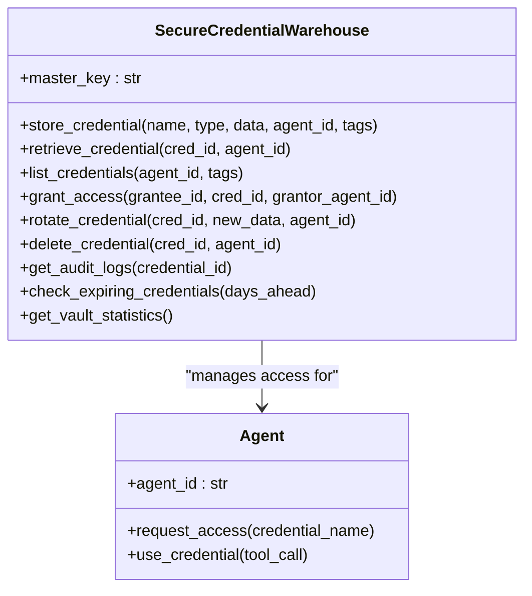
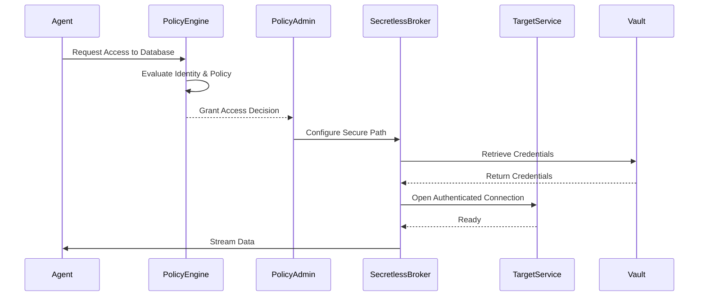
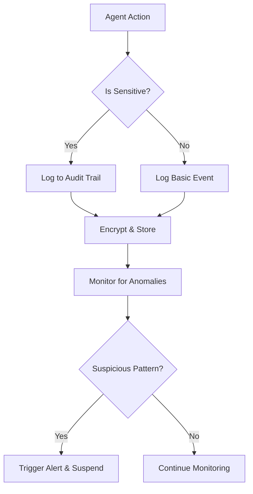

# Zero-Trust Security Model

<cite>
**Referenced Files in This Document**   
- [policy_engine.py](file://371-os/src/minds371/adaptive_llm_router/policy_engine.py#L1-L34)
- [credential_warehouse_agent.py](file://371-os/src/minds371/agents/utility/credential_warehouse_agent.py#L0-L203)
- [credential_warehouse_agent.yaml](file://prompts/utility_agents/credential_warehouse_agent.yaml#L0-L41)
- [system_architecture.html](file://371-os/docs/architecture/system_architecture.html#L528-L586)
- [researchprotocol.md](file://thought_leadership/AASA/researchprotocol.md#L749-L919)
- [Revolutionary Autonomous Agent Operating System.md](file://thought_leadership/AASA/Revolutionary Autonomous Agent Operating System.md#L17-L25)
- [IMPLEMENTATION_GUIDE.md](file://IMPLEMENTATION_GUIDE.md#L398-L481)
- [Legal and Compliance Guide.txt](file://Consulting/Legal and Compliance Guide.txt#L1308-L1476)
</cite>

## Table of Contents
1. [Introduction](#introduction)
2. [Core Components of the Zero-Trust Model](#core-components-of-the-zero-trust-model)
3. [Secretless Broker Integration](#secretless-broker-integration)
4. [Agent Identity and Policy Enforcement](#agent-identity-and-policy-enforcement)
5. [Secure Credential Management](#secure-credential-management)
6. [Authentication and Authorization Flow](#authentication-and-authorization-flow)
7. [Audit Logging and Session Monitoring](#audit-logging-and-session-monitoring)
8. [Revocation and Rotation Mechanisms](#revocation-and-rotation-mechanisms)
9. [Configuration and Deployment Guidance](#configuration-and-deployment-guidance)
10. [Conclusion](#conclusion)

## Introduction
The Zero-Trust Security Model implemented in the Universal Tool Server leverages the Secretless Broker and ACI.dev integration to eliminate hardcoded credentials and enforce strict access controls. This model ensures that agents can access external services only through dynamic, just-in-time authentication based on verified identity and policy decisions. By integrating blockchain-verified credentials and decentralized identity, the system enforces least-privilege access at every interaction point. This document details how the architecture achieves zero-trust principles through secure credential injection, runtime policy enforcement, and comprehensive auditability across agent operations.

## Core Components of the Zero-Trust Model
The Zero-Trust architecture is built upon three core logical components as defined by NIST SP 800-207: the Policy Engine (PE), Policy Administrator (PA), and Policy Enforcement Point (PEP). These components work in concert to ensure that every access request is evaluated dynamically based on identity, device posture, and environmental context.



**Diagram sources**
- [Revolutionary Autonomous Agent Operating Systemv1.1thinking.md](file://thought_leadership/AASA/Revolutionary Autonomous Agent Operating Systemv1.1thinking.md#L288-L422)

**Section sources**
- [researchprotocol.md](file://thought_leadership/AASA/researchprotocol.md#L749-L793)

## Secretless Broker Integration
The Secretless Broker acts as a connection broker that relieves client applications from directly handling secrets. Instead of embedding credentials in code or configuration files, agents connect to the Secretless Broker, which transparently injects the required credentials when establishing connections to target services such as databases, HTTP APIs, or SSH endpoints.

The broker supports multiple protocols including PostgreSQL, MySQL, HTTP, and SSH, and retrieves credentials from secure vaults like CyberArk Conjur or HashiCorp Vault. It runs locally alongside the agent or as a sidecar container in Kubernetes environments, ensuring secure communication via Unix sockets or loopback interfaces.



**Diagram sources**
- [IMPLEMENTATION_GUIDE.md](file://IMPLEMENTATION_GUIDE.md#L398-L440)

**Section sources**
- [researchprotocol.md](file://thought_leadership/AASA/researchprotocol.md#L806-L878)

## Agent Identity and Policy Enforcement
Agents prove their identity using blockchain-verified credentials before accessing any tools or data. The Policy Engine evaluates each access request against dynamic policies that consider agent identity, task criticality, data sensitivity, and current system state.

The `policy_engine.py` module implements a decision graph that selects appropriate service providers based on metadata and budget constraints. For example, confidential tasks are routed to local models, while high-quality requirements trigger premium cloud-based LLMs if budget permits.

```python
def select_provider(meta: Dict[str, Any], est_in: int, est_out: int) -> str:
    """
    Selects the best provider and model based on task metadata and budget.
    """
    if meta.get("confidential"):
        return "localai:phi-4-14b"
    if meta.get("quality") == "high" and budget_manager.get_remaining_budget_percentage() > 0.20:
        return "openrouter:gpt-4o-mini"
    if est_in > 8000:
        return "requesty:claude-3-sonnet"
    if budget_manager.get_remaining_budget_percentage() < 0.05:
        return "openrouter:mistral-7b"
    return "openrouter:qwen2-72b"
```

**Section sources**
- [policy_engine.py](file://371-os/src/minds371/adaptive_llm_router/policy_engine.py#L1-L34)

## Secure Credential Management
The **SecureCredentialWarehouse** provides encrypted storage and fine-grained access control for sensitive credentials such as API keys, database passwords, and payment processor tokens. All credentials are encrypted using AES-256 before storage, and access is strictly governed by role-based permissions.

Agents can store, retrieve, rotate, and delete credentials through a secure interface. Only the credential creator or authorized delegates can grant access to other agents. Comprehensive audit logging tracks all operations for compliance and forensic analysis.



**Diagram sources**
- [credential_warehouse_agent.py](file://371-os/src/minds371/agents/utility/credential_warehouse_agent.py#L0-L203)

**Section sources**
- [system_architecture.html](file://371-os/docs/architecture/system_architecture.html#L528-L550)

## Authentication and Authorization Flow
When an agent requests access to a tool or service, the following authentication and authorization flow is executed:

1. The agent submits a request to the Universal Tool Server.
2. The Policy Engine evaluates the request based on agent identity, task metadata, and current policies.
3. If approved, the Policy Administrator configures the secure communication path.
4. The Secretless Broker injects credentials obtained from a secure vault.
5. The Policy Enforcement Point allows the connection to proceed.
6. The tool executes, and all actions are logged for audit purposes.

This flow ensures that no agent ever handles raw credentials, and access is granted only for specific, time-bound operations.



**Section sources**
- [Revolutionary Autonomous Agent Operating System.md](file://thought_leadership/AASA/Revolutionary Autonomous Agent Operating System.md#L17-L25)

## Audit Logging and Session Monitoring
All security-related operations are logged in a tamper-evident audit trail. The system captures:
- Agent authentication events
- Credential access attempts
- Policy decision outcomes
- Tool execution records
- Data access and modification activities

Real-time monitoring detects anomalous behavior patterns, such as unexpected access requests or abnormal data transfers. Automated intervention mechanisms can suspend suspicious agents and alert administrators.



**Section sources**
- [Legal and Compliance Guide.txt](file://Consulting/Legal and Compliance Guide.txt#L1384-L1476)

## Revocation and Rotation Mechanisms
Credentials are automatically rotated based on predefined schedules (e.g., every 15 days) or triggered manually via the `rotate_credential` API. Upon rotation, the old credential is invalidated, and the new one is injected seamlessly by the Secretless Broker without requiring agent restarts.

Access revocation is immediate. When an agent’s privileges are revoked or its identity is compromised, all active sessions are terminated, and future access requests are denied at the Policy Enforcement Point.

The system also supports just-in-time (JIT) access provisioning, where temporary credentials are issued for specific tasks and automatically expire after completion.

**Section sources**
- [researchprotocol.md](file://thought_leadership/AASA/researchprotocol.md#L880-L909)

## Configuration and Deployment Guidance
To integrate Secretless Broker with ACI.dev in decentralized environments like Akash Network:

1. **Configure Secretless Broker**:
```bash
mkdir -p config/security
cat > config/security/secretless.yml << 'EOF'
version: "2"
services:
  - name: elizaos-agents
    connector: generic_http
    authentication:
      - type: oauth2
        config:
          token_url: "${ACI_TOKEN_URL}"
          client_id: "${ACI_CLIENT_ID}"
          client_secret: "${ACI_CLIENT_SECRET}"
          scope: "agent:execute blockchain:read"
    config:
      headers:
        Authorization: "Bearer {{ .access_token }}"
EOF
```

2. **Deploy with ACI.dev**:
```json
{
  "cloud_provider": "akash",
  "security_profile": "zero-trust",
  "compliance": ["SOC2", "GDPR"],
  "security": {
    "credential_injection": "secretless",
    "network_isolation": true,
    "audit_logging": true
  }
}
```

3. **Start Secure Environment**:
```bash
# Start Secretless Broker
secretless-broker -f config/security/secretless.yml &
sleep 5
# Start agents
npm run start:agents:production
```

**Section sources**
- [IMPLEMENTATION_GUIDE.md](file://IMPLEMENTATION_GUIDE.md#L398-L481)

## Conclusion
The Zero-Trust Security Model in the Universal Tool Server effectively eliminates hardcoded credentials through the integration of Secretless Broker and ACI.dev. By enforcing dynamic, identity-based access control and leveraging blockchain-verified credentials, the system ensures that agents operate under strict least-privilege principles. Comprehensive audit logging, automatic credential rotation, and real-time monitoring further enhance security in decentralized environments. This architecture provides a robust foundation for secure, scalable, and compliant multi-agent systems.