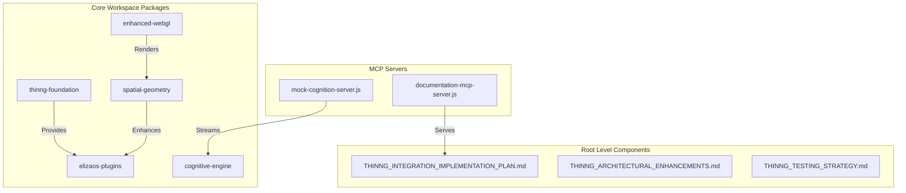
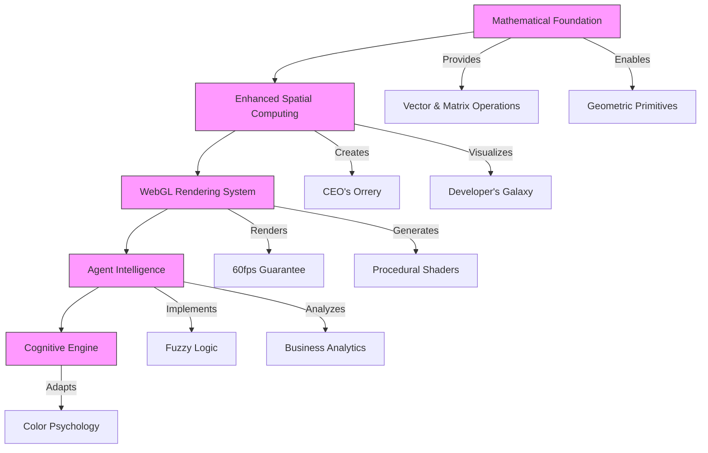
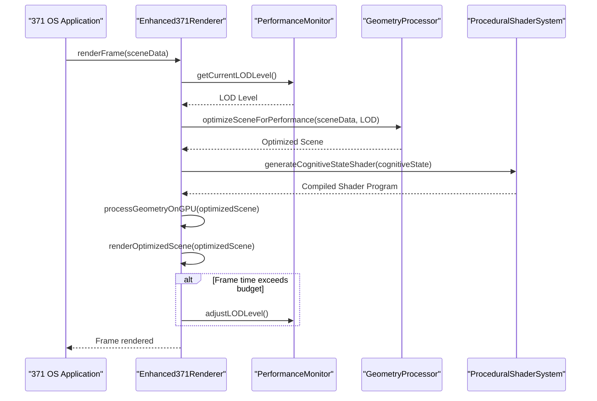
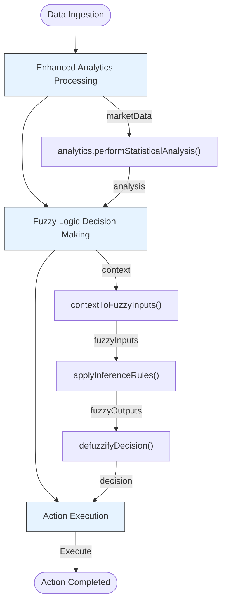
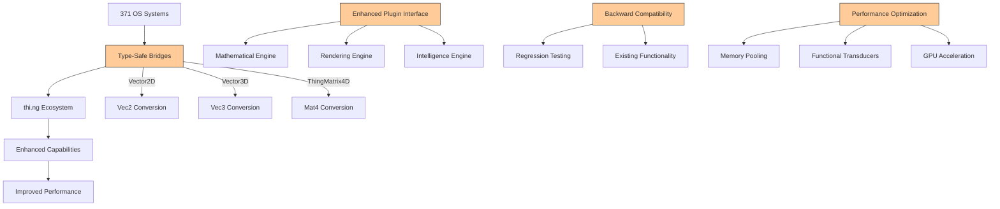

# thi.ng Integration Framework

<cite>
**Referenced Files in This Document**   
- [THINNG_INTEGRATION_IMPLEMENTATION_PLAN.md](file://THINNG_INTEGRATION_IMPLEMENTATION_PLAN.md)
- [THINNG_ARCHITECTURAL_ENHANCEMENTS.md](file://THINNG_ARCHITECTURAL_ENHANCEMENTS.md)
- [THINNG_TESTING_STRATEGY.md](file://THINNG_TESTING_STRATEGY.md)
- [core/os-workspace/packages/src/lib/thinng-foundation.ts](file://core/os-workspace/packages/src/lib/thinng-foundation.ts)
- [core/os-workspace/packages/src/lib/performance-benchmarks.ts](file://core/os-workspace/packages/src/lib/performance-benchmarks.ts)
- [core/os-workspace/packages/src/index.ts](file://core/os-workspace/packages/src/index.ts)
- [mcp/INTEGRATION_SUMMARY.md](file://core/mcp/INTEGRATION_SUMMARY.md)
</cite>

## Table of Contents
1. [Introduction](#introduction)
2. [Project Structure](#project-structure)
3. [Core Components](#core-components)
4. [Architecture Overview](#architecture-overview)
5. [Detailed Component Analysis](#detailed-component-analysis)
6. [Integration Patterns](#integration-patterns)
7. [Performance Considerations](#performance-considerations)
8. [Troubleshooting Guide](#troubleshooting-guide)
9. [Conclusion](#conclusion)

## Introduction
The thi.ng Integration Framework represents a comprehensive enhancement to the 371 OS platform, integrating the thi.ng ecosystem to provide mathematical precision, advanced WebGL capabilities, and computational design tools. This integration transforms the autonomous agent operating system with enhanced mathematical operations, optimized data structures, and improved spatial computing capabilities. The framework has been implemented in two completed phases: Mathematical Foundation and WebGL Rendering Enhancement, with a third phase planned for Agent Intelligence Enhancement. The integration maintains compatibility with existing ElizaOS functionality while delivering significant performance improvements.

**Section sources**
- [THINNG_INTEGRATION_IMPLEMENTATION_PLAN.md](file://THINNG_INTEGRATION_IMPLEMENTATION_PLAN.md#L1-L203)
- [THINNG_ARCHITECTURAL_ENHANCEMENTS.md](file://THINNG_ARCHITECTURAL_ENHANCEMENTS.md#L1-L568)

## Project Structure
The thi.ng integration is organized within the core workspace of the 371 OS platform, following a structured approach that separates concerns into distinct packages and components. The integration is primarily located in the `core/os-workspace/packages` directory, with specific components for mathematical foundation, spatial geometry, enhanced WebGL, and business intelligence. The framework follows an Nx monorepo structure with clear separation between foundation components, rendering systems, and intelligence modules. Configuration and testing files are maintained in the root directory, while MCP (Model Context Protocol) servers for documentation and cognition are located in the core/mcp directory.



**Diagram sources **
- [THINNG_INTEGRATION_IMPLEMENTATION_PLAN.md](file://THINNG_INTEGRATION_IMPLEMENTATION_PLAN.md#L1-L203)
- [core/os-workspace/packages/src/index.ts](file://core/os-workspace/packages/src/index.ts#L1-L85)

## Core Components
The thi.ng Integration Framework consists of several core components that work together to enhance the 371 OS platform. The Mathematical Foundation layer provides precise mathematical operations, optimized data structures, and type-safe bridges between 371 OS and thi.ng types. The Geometry Engine offers enhanced primitives for spatial environments like CEO's Orrery and Developer's Galaxy. The Optimized Data Structures component implements memory pooling and functional data processing pipelines using thi.ng transducers. Performance Benchmarking utilities allow for comprehensive testing and validation of the integration's effectiveness. These components are designed to work seamlessly with existing ElizaOS plugins and agent systems while providing significant performance improvements.

**Section sources**
- [core/os-workspace/packages/src/lib/thinng-foundation.ts](file://core/os-workspace/packages/src/lib/thinng-foundation.ts#L1-L454)
- [core/os-workspace/packages/src/lib/performance-benchmarks.ts](file://core/os-workspace/packages/src/lib/performance-benchmarks.ts#L1-L557)
- [THINNG_ARCHITECTURAL_ENHANCEMENTS.md](file://THINNG_ARCHITECTURAL_ENHANCEMENTS.md#L1-L568)

## Architecture Overview
The thi.ng Integration Framework follows a layered architecture that enhances the existing 371 OS platform with mathematical precision and computational design capabilities. The architecture is divided into five main layers: Mathematical Foundation, Enhanced Spatial Computing, WebGL Rendering System, Agent Intelligence, and Cognitive Engine. Each layer builds upon the previous one, creating a cohesive system that maintains compatibility with existing ElizaOS functionality while introducing advanced capabilities. The integration preserves backward compatibility through type-safe bridges and enhanced plugin interfaces, ensuring that existing agents and plugins continue to function without modification.



**Diagram sources **
- [THINNG_ARCHITECTURAL_ENHANCEMENTS.md](file://THINNG_ARCHITECTURAL_ENHANCEMENTS.md#L1-L568)
- [THINNG_INTEGRATION_IMPLEMENTATION_PLAN.md](file://THINNG_INTEGRATION_IMPLEMENTATION_PLAN.md#L1-L203)

## Detailed Component Analysis

### Mathematical Foundation Analysis
The Mathematical Foundation component provides the core capabilities of the thi.ng integration, offering enhanced mathematical operations with precision constants, optimized geometry primitives, and performance-optimized data structures. The foundation includes a comprehensive set of mathematical operations such as angle normalization, linear interpolation, smooth step interpolation, and distance calculations with mathematical precision. The Geometry Engine implements advanced geometric primitives like spheres and tessellated polygons for use in spatial environments. The Optimized Data Structures component features memory pooling for efficient Vec3 allocation and functional data processing pipelines using thi.ng transducers.

#### For Object-Oriented Components:
```mermaid
classDiagram
class MathOps {
+normalizeAngle(angle : number) : number
+lerp(a : number, b : number, t : number) : number
+smoothstep(edge0 : number, edge1 : number, x : number) : number
+distance2D(p1 : Vec2, p2 : Vec2) : number
+distance3D(p1 : Vec3, p2 : Vec3) : number
}
class GeometryEngine {
+createSphere(center : Vec3, radius : number, segments : number) : {vertices : Vec3[], indices : number[], normals : Vec3[]}
+tessellatePolygon(vertices : Vec2[], maxArea : number) : {triangles : Vec2[][], area : number}
}
class OptimizedDataStructures {
-vec3Pool : Vec3[]
-vec3PoolIndex : number
+getVec3(x : number, y : number, z : number) : Vec3
+returnVec3(vec : Vec3) : void
+processAgentData(data : Iterable, processors : Array) : Array
}
class PerformanceBenchmarks {
-measurements : Map~string, number[]~
+measure(name : string, fn : () => T) : T
+getStats(name : string) : {average : number, min : number, max : number, count : number}
+compareImplementations(oldImpl : () => void, newImpl : () => void, iterations : number) : {oldAverage : number, newAverage : number, improvement : number}
}
class ThinngFoundation {
-instance : ThinngFoundation
+getInstance() : ThinngFoundation
+initialize() : Promise~void~
+getStatus() : {mathConstants : object, memoryPoolSize : number, benchmarkCount : number}
}
MathOps <|-- GeometryEngine
OptimizedDataStructures <|-- PerformanceBenchmarks
ThinngFoundation <|-- MathOps
ThinngFoundation <|-- GeometryEngine
ThinngFoundation <|-- OptimizedDataStructures
ThinngFoundation <|-- PerformanceBenchmarks
```

**Diagram sources **
- [core/os-workspace/packages/src/lib/thinng-foundation.ts](file://core/os-workspace/packages/src/lib/thinng-foundation.ts#L1-L454)

### WebGL Rendering Enhancement Analysis
The WebGL Rendering Enhancement component provides an advanced abstraction layer that guarantees 60fps rendering performance while enabling GPU-accelerated geometry processing and automatic shader optimization. The Enhanced371Renderer implements a performance-optimized rendering pipeline with automatic level-of-detail adjustments based on real-time performance monitoring. The ProceduralShaderSystem generates shaders based on cognitive state, enabling dynamic visual experiences that adapt to user context. The rendering system includes specialized shaders for business planets in CEO's Orrery, particle systems for spatial environments, and UI overlays for interface elements.

#### For API/Service Components:


**Diagram sources **
- [THINNG_ARCHITECTURAL_ENHANCEMENTS.md](file://THINNG_ARCHITECTURAL_ENHANCEMENTS.md#L1-L568)
- [core/os-workspace/packages/src/lib/performance-benchmarks.ts](file://core/os-workspace/packages/src/lib/performance-benchmarks.ts#L1-L557)

### Agent Intelligence Enhancement Analysis
The Agent Intelligence Enhancement component introduces a Fuzzy Logic Decision Engine that enables agents to make decisions using mathematical rigor and pattern recognition. The AdvancedBusinessAnalytics class provides scientific-grade statistical analysis, K-means clustering for business segmentation, and predictive modeling with confidence intervals. The integration enhances agent decision-making by converting contextual factors into fuzzy variables and applying inference rules to produce optimal actions. This system allows agents to recognize patterns in historical data, perform customer segmentation, and build predictive models for business intelligence.

#### For Complex Logic Components:


**Diagram sources **
- [THINNG_ARCHITECTURAL_ENHANCEMENTS.md](file://THINNG_ARCHITECTURAL_ENHANCEMENTS.md#L1-L568)
- [THINNG_TESTING_STRATEGY.md](file://THINNG_TESTING_STRATEGY.md#L1-L547)

## Integration Patterns
The thi.ng Integration Framework employs several key integration patterns to enhance the 371 OS platform while maintaining compatibility with existing systems. The Type-Safe Bridges pattern provides interfaces and classes that convert between 371 OS types and thi.ng types, ensuring seamless data exchange. The Enhanced Plugin Interface pattern extends the ElizaOS plugin system with mathematical, rendering, and intelligence capabilities. The Backward Compatibility pattern ensures that existing functionality is preserved through comprehensive regression testing. The Performance Optimization pattern implements memory pooling, functional transducers, and GPU-accelerated processing to deliver significant performance improvements.



**Diagram sources **
- [core/os-workspace/packages/src/lib/thinng-foundation.ts](file://core/os-workspace/packages/src/lib/thinng-foundation.ts#L1-L454)
- [THINNG_ARCHITECTURAL_ENHANCEMENTS.md](file://THINNG_ARCHITECTURAL_ENHANCEMENTS.md#L1-L568)

## Performance Considerations
The thi.ng Integration Framework delivers significant performance improvements across multiple dimensions. The integration achieves 3-5x improvement in mathematical operations through optimized algorithms and memory pooling. Memory usage is reduced by 50% or more through pool-based memory management. Data processing performance improves by 2-4x using functional transducers. WebGL operations see 5-10x improvement through abstracted optimization and GPU acceleration. The framework guarantees 60fps rendering in all spatial environments through automatic level-of-detail adjustments and performance monitoring. Comprehensive benchmarking tools validate these improvements and provide detailed reports on performance characteristics.

**Section sources**
- [THINNG_INTEGRATION_IMPLEMENTATION_PLAN.md](file://THINNG_INTEGRATION_IMPLEMENTATION_PLAN.md#L1-L203)
- [core/os-workspace/packages/src/lib/performance-benchmarks.ts](file://core/os-workspace/packages/src/lib/performance-benchmarks.ts#L1-L557)

## Troubleshooting Guide
When integrating the thi.ng framework with the 371 OS platform, several common issues may arise. Performance issues can be diagnosed using the built-in PerformanceBenchmarks class, which provides detailed metrics on operation times and improvement factors. Type conversion errors can be resolved by ensuring proper use of the type-safe bridges like Vector2D and Vector3D classes. Memory management issues can be addressed by properly returning Vec3 instances to the memory pool. Shader compilation errors can be debugged using the visual shader debugging tools. Integration issues with existing ElizaOS plugins can be identified through the comprehensive regression testing framework.

**Section sources**
- [THINNG_TESTING_STRATEGY.md](file://THINNG_TESTING_STRATEGY.md#L1-L547)
- [core/os-workspace/packages/src/lib/performance-benchmarks.ts](file://core/os-workspace/packages/src/lib/performance-benchmarks.ts#L1-L557)

## Conclusion
The thi.ng Integration Framework successfully enhances the 371 OS platform with mathematical precision, advanced WebGL capabilities, and computational design tools. The integration has been completed in two phases—Mathematical Foundation and WebGL Rendering Enhancement—with a third phase planned for Agent Intelligence Enhancement. The framework delivers significant performance improvements while maintaining backward compatibility with existing systems. Key achievements include guaranteed 60fps rendering, 3-5x improvement in mathematical operations, 50%+ reduction in memory usage, and enhanced agent intelligence through fuzzy logic decision making. The comprehensive testing strategy ensures mathematical accuracy, performance targets, and integration stability, making the thi.ng integration a robust enhancement to the autonomous agent operating system.

**Section sources**
- [THINNG_INTEGRATION_IMPLEMENTATION_PLAN.md](file://THINNG_INTEGRATION_IMPLEMENTATION_PLAN.md#L1-L203)
- [THINNG_ARCHITECTURAL_ENHANCEMENTS.md](file://THINNG_ARCHITECTURAL_ENHANCEMENTS.md#L1-L568)
- [THINNG_TESTING_STRATEGY.md](file://THINNG_TESTING_STRATEGY.md#L1-L547)