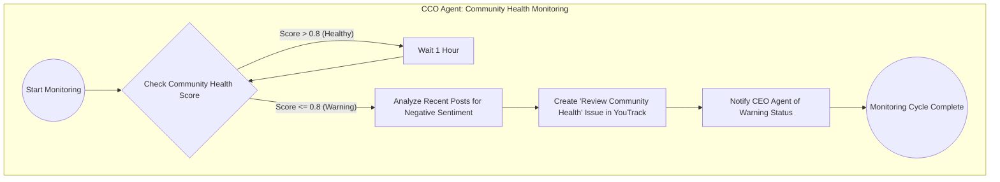

# CCO Agent: Community Health Monitoring

## Purpose

The CCO (Chief Community Officer) Agent is responsible for monitoring the health of the community platform. It periodically checks a community health score and takes action if the score falls below a certain threshold, indicating a potential issue.

## Functionality

The agent's workflow is as follows:

1.  **Start Monitoring**: The agent begins its monitoring cycle.
2.  **Check Community Health Score**: It retrieves the current community health score.
3.  **Evaluate Score**:
    *   If the score is **greater than 0.8**, the community is considered healthy. The agent will wait for 1 hour before checking the score again.
    *   If the score is **less than or equal to 0.8**, this triggers a warning state.
4.  **Warning State Actions**:
    *   **Analyze Recent Posts**: The agent analyzes recent community posts to identify negative sentiment.
    *   **Create YouTrack Issue**: It creates a new issue in YouTrack with the title "Review Community Health" to alert the team.
    *   **Notify CEO Agent**: It sends a notification to the CEO Agent to inform them of the warning status.
5.  **Cycle Complete**: After these actions, the monitoring cycle is considered complete. The agent will then wait for the next scheduled monitoring interval.

This workflow is visualized in the following diagram:

