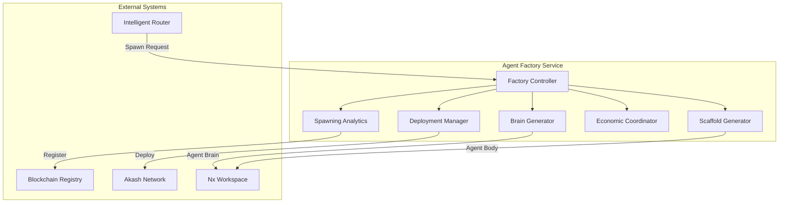

# Agent Factory Service

The Agent Factory Service enables autonomous agent spawning for the 371 OS ecosystem. When the Intelligent Router detects capability gaps, the Factory automatically creates, deploys, and registers new specialized agents to fill those gaps.

## 🚀 Key Features

### Autonomous Agent Creation
- **Capability Gap Detection**: Automatically identifies missing capabilities in the agent ecosystem
- **Brain Generation**: Creates agent definition YAML files with appropriate personality traits and tools
- **Body Scaffolding**: Generates complete Nx applications with ElizaOS integration
- **Self-Registration**: New agents automatically register with the Blockchain Registry

### Economic Safeguards
- **Cost Controls**: Rate limiting and budget enforcement prevent excessive spawning
- **Economic Validation**: Pre-spawn cost analysis with budget allocation checks
- **Performance Tracking**: Monitors spawning success rates and cost efficiency

### Production-Ready Deployment
- **Akash Network Integration**: Deploys agents with 97.6% cost reduction
- **Health Monitoring**: Continuous health checks and performance monitoring
- **Graceful Scaling**: Handles concurrent spawning with queue management

## 🏗️ Architecture

The Agent Factory follows a microservices architecture with these core components:



## 📋 Core Components

### Factory Controller
- **Main Orchestrator**: Coordinates the entire spawning process
- **Queue Management**: Handles concurrent spawn requests efficiently
- **Event System**: Emits progress events for monitoring and debugging
- **Health Monitoring**: Provides comprehensive system health checks

### Brain Generator
- **YAML Generation**: Creates agent definition files in the prompts library
- **Personality Mapping**: Generates appropriate traits based on capability analysis
- **Template System**: Uses configurable templates for different agent types
- **Performance Targets**: Sets appropriate performance expectations

### Scaffold Generator
- **Nx Integration**: Creates complete Nx applications for agent bodies
- **ElizaOS Compatibility**: Generates code compatible with ElizaOS runtime
- **Dependency Management**: Configures appropriate dependencies and build tools
- **Integration Points**: Sets up blockchain registry and router integration

### Deployment Manager
- **Akash Network**: Deploys agents to decentralized infrastructure
- **Container Management**: Handles Docker builds and deployment
- **Health Verification**: Ensures deployed agents are operational
- **Cost Optimization**: Leverages Akash for 97.6% cost reduction

### Economic Coordinator
- **Budget Controls**: Enforces spending limits and rate controls
- **Cost Estimation**: Calculates spawning costs based on requirements
- **Economic Validation**: Pre-approval process for spawn requests
- **Financial Tracking**: Monitors costs and budget utilization

### Spawning Analytics
- **Metrics Collection**: Tracks spawning success rates and performance
- **Trend Analysis**: Identifies capability gap patterns and frequencies
- **Agent Utilization**: Monitors spawned agent performance and usage
- **Optimization Insights**: Provides data for factory optimization

## 🔧 Usage

### Basic Spawning

```typescript
import { AgentFactory, SpawnRequest, SpawnPriority } from './agent-factory';

const factory = new AgentFactory();

const spawnRequest: SpawnRequest = {
  capability: 'customer-service-specialist',
  taskDescription: 'Handle customer inquiries and provide technical support',
  priority: SpawnPriority.MEDIUM,
  requesterAgent: 'intelligent-router',
  originalTaskId: 'task_123',
  domainHints: ['customer-service', 'technical-support'],
  performanceRequirements: {
    maxResponseTime: 3000,
    minSuccessRate: 0.90,
    maxEscalationRate: 0.10
  }
};

const result = await factory.spawnAgent(spawnRequest);
if (result.success) {
  console.log(`Agent spawning initiated: ${result.data.spawnId}`);
}
```

### Monitoring Spawning Progress

```typescript
// Check spawn status
const status = factory.getSpawnStatus(spawnId);
console.log(`Status: ${status.data.status}`);

// Get factory metrics
const metrics = await factory.getMetrics();
console.log(`Success rate: ${metrics.data.successfulSpawns / metrics.data.totalSpawnRequests}`);

// Health check
const health = await factory.healthCheck();
console.log(`Factory healthy: ${health.data.healthy}`);
```

### Configuration

```typescript
const factory = new AgentFactory({
  brainGenerator: {
    outputDirectory: './custom-agents',
    defaultPersonalityTraits: {
      innovative: 'Brings creative solutions to challenges'
    }
  },
  economicCoordinator: {
    budgetEnforcementLevel: 'advisory' // 'strict' | 'advisory' | 'disabled'
  }
});
```

## 🔄 Integration with 371 OS

### Intelligent Router Integration
- Router detects capability gaps during task routing
- Automatically triggers agent spawning for missing capabilities
- Queues original task for retry after agent becomes available

### Blockchain Registry Integration
- New agents self-register capabilities upon deployment
- Cryptographic verification ensures agent authenticity
- Performance metrics track spawned agent effectiveness

### Nx Workspace Integration
- Leverages existing nx-workspace plugin for self-awareness
- Generates agents as proper Nx applications
- Maintains consistent build and deployment patterns

## 📊 Performance Metrics

The factory tracks comprehensive metrics:

- **Spawn Success Rate**: Percentage of successful agent deployments
- **Average Spawn Time**: Time from request to operational agent
- **Cost Efficiency**: Average cost per successful spawn
- **Agent Retention**: Percentage of spawned agents remaining active
- **Capability Gap Trends**: Most frequently requested missing capabilities

## 🛡️ Security Features

### Economic Safeguards
- **Rate Limiting**: Maximum spawns per hour to prevent abuse
- **Budget Controls**: Strict budget enforcement with alerts
- **Cost Thresholds**: Automatic approval limits for cost control

### Identity Verification
- **Cryptographic Keys**: Each spawned agent receives verified identity
- **Reputation Staking**: Economic incentives for good behavior
- **Audit Trails**: Complete spawning history with blockchain verification

## 🚀 Development Commands

```bash
# Build the factory service
bun nx build agent-factory

# Run the factory service
bun nx serve agent-factory

# Run demonstration
bun run apps/agent-factory/src/index.ts

# Health check
curl http://localhost:3000/health

# Get metrics
curl http://localhost:3000/metrics
```

## 🔗 Related Components

- [`intelligent-router`](../intelligent-router/) - Detects capability gaps and triggers spawning
- [`blockchain-registry`](../../packages/universal-tool-server/) - Registers spawned agents
- [`nx-workspace`](../../packages/nx-workspace/) - Provides self-awareness capabilities
- [`cognitive-engine`](../../packages/cognitive-engine/) - Powers adaptive behavior

## 📈 Roadmap

- **Multi-Cloud Deployment**: Support for additional deployment targets beyond Akash
- **Advanced Templates**: More sophisticated agent templates for complex capabilities
- **ML Optimization**: Machine learning for spawn decision optimization
- **Federation**: Cross-network agent spawning and coordination

---

**🤖 Autonomous Agent Spawning - Transforming 371 OS into a self-evolving ecosystem! ⚡**