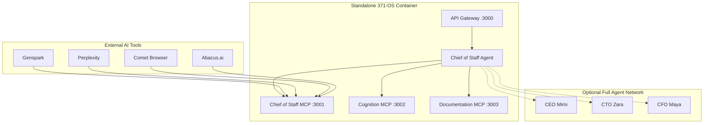

# Standalone Deployment Guide - 371-OS

## 🎯 Standalone Mode Overview

Standalone mode provides a self-contained deployment of the 371-OS agent system, specifically designed for integration with external AI tools and platforms while maintaining the core agent coordination capabilities.

### Key Features
- **Minimal footprint** with essential agents only
- **MCP server** endpoints for external integration
- **Chief of Staff** as primary coordination hub
- **High-level Cognition** access for intelligent adaptation
- **Cross-platform compatibility** with streamlined dependencies

## 🏗️ Standalone Architecture



## 🚀 Deployment Options

### Option 1: Minimal Standalone
**Components**: Chief of Staff + MCP Servers + API Gateway
```bash
# Start minimal standalone deployment
bun nx serve chief-of-staff-agent --standalone --minimal

# Exposed endpoints:
# http://localhost:3000 - API Gateway
# mcp://localhost:3001 - Chief of Staff MCP
# mcp://localhost:3002 - Cognition MCP
```

### Option 2: Enhanced Standalone  
**Components**: Core agents + MCP Servers + Cognitive Interface
```bash
# Start enhanced standalone deployment
bun nx serve chief-of-staff-agent --standalone --enhanced

# Additional capabilities:
# - Cognitive state detection
# - Advanced workflow orchestration
# - Multi-agent coordination
```

### Option 3: Full Ecosystem (Connected)
**Components**: All agents + Full MCP ecosystem + External integrations
```bash
# Start full ecosystem in standalone mode
bun run system:full-start --standalone

# Complete 371-OS capabilities while maintaining external integration
```

## ⚙️ Configuration Files

### Standalone Configuration (`standalone.config.json`)
```json
{
  "standalone": {
    "mode": "enhanced",
    "version": "1.0.0",
    "description": "371-OS Standalone Deployment for External AI Integration"
  },
  "runtime": {
    "packageManager": "bun",
    "platform": "cross_platform",
    "entry_point": "chief-of-staff-agent",
    "hot_reload": false,
    "production_ready": true
  },
  "services": {
    "api_gateway": {
      "enabled": true,
      "port": 3000,
      "cors": true,
      "authentication": "token_based"
    },
    "mcp_servers": {
      "chief_of_staff": {
        "enabled": true,
        "port": 3001,
        "capabilities": ["task_coordination", "workflow_management", "agent_communication"]
      },
      "cognition": {
        "enabled": true,
        "port": 3002,
        "access_level": "high",
        "capabilities": ["cognitive_detection", "adaptive_interfaces", "mode_coordination"]
      },
      "documentation": {
        "enabled": true,
        "port": 3003,
        "capabilities": ["knowledge_retrieval", "context_provision", "documentation_management"]
      }
    }
  },
  "agents": {
    "chief_of_staff": {
      "required": true,
      "brain_file": "libs/prompts/agent-definitions/chief_of_staff.yml",
      "capabilities": ["coordination", "external_integration", "workflow_orchestration"]
    },
    "cognitive_interface": {
      "optional": true,
      "brain_file": "libs/prompts/agent-definitions/cognitive_interface.yml",
      "capabilities": ["adaptive_ui", "cognitive_detection"]
    }
  },
  "external_integrations": {
    "supported_tools": ["genspark", "perplexity", "comet_browser", "abacus_ai"],
    "authentication": {
      "type": "api_token",
      "token_env": "STANDALONE_API_TOKEN",
      "refresh_interval": "24h"
    },
    "rate_limiting": {
      "requests_per_minute": 100,
      "burst_limit": 20
    }
  },
  "performance": {
    "memory_limit": "512MB",
    "cpu_limit": "1 core",
    "startup_time": "5 seconds",
    "response_time": "100ms average"
  }
}
```

### Docker Deployment (`Dockerfile.standalone`)
```dockerfile
# 371-OS Standalone Deployment
FROM oven/bun:1.2.18-slim as base

# Set working directory
WORKDIR /app

# Copy package files
COPY package.json bun.lockb ./
COPY core/os-workspace/package.json ./core/os-workspace/

# Install dependencies (lightning fast with Bun)
RUN bun install --frozen-lockfile

# Copy source code
COPY . .

# Build standalone bundle
RUN bun nx build chief-of-staff-agent --standalone

# Production stage
FROM oven/bun:1.2.18-slim as production

WORKDIR /app

# Copy built application
COPY --from=base /app/dist ./
COPY --from=base /app/core/mcp ./core/mcp
COPY --from=base /app/libs/prompts/agent-definitions ./libs/prompts/agent-definitions

# Expose ports
EXPOSE 3000 3001 3002 3003

# Health check
HEALTHCHECK --interval=30s --timeout=3s --start-period=5s --retries=3 \
  CMD bun run health-check || exit 1

# Start standalone deployment
CMD ["bun", "start", "--standalone"]
```

### Kubernetes Deployment (`k8s-standalone.yaml`)
```yaml
apiVersion: apps/v1
kind: Deployment
metadata:
  name: 371os-standalone
  labels:
    app: 371os-standalone
spec:
  replicas: 1
  selector:
    matchLabels:
      app: 371os-standalone
  template:
    metadata:
      labels:
        app: 371os-standalone
    spec:
      containers:
      - name: 371os
        image: 371minds/os:standalone-latest
        ports:
        - containerPort: 3000
          name: api-gateway
        - containerPort: 3001
          name: chief-mcp
        - containerPort: 3002
          name: cognition-mcp
        env:
        - name: STANDALONE_MODE
          value: "true"
        - name: STANDALONE_API_TOKEN
          valueFrom:
            secretKeyRef:
              name: 371os-secrets
              key: api-token
        resources:
          requests:
            memory: "256Mi"
            cpu: "250m"
          limits:
            memory: "512Mi"
            cpu: "500m"
        livenessProbe:
          httpGet:
            path: /health
            port: 3000
          initialDelaySeconds: 10
          periodSeconds: 30
        readinessProbe:
          httpGet:
            path: /ready
            port: 3000
          initialDelaySeconds: 5
          periodSeconds: 10
---
apiVersion: v1
kind: Service
metadata:
  name: 371os-standalone-service
spec:
  selector:
    app: 371os-standalone
  ports:
  - name: api-gateway
    port: 3000
    targetPort: 3000
  - name: chief-mcp
    port: 3001
    targetPort: 3001
  - name: cognition-mcp
    port: 3002
    targetPort: 3002
  type: LoadBalancer
```

## 🔧 Setup Instructions

### 1. Local Standalone Setup
```bash
# Clone and navigate to workspace
cd f:/os-main/core/os-workspace

# Install dependencies (lightning fast)
bun install

# Configure standalone mode
cp standalone.config.example.json standalone.config.json
# Edit configuration as needed

# Start standalone deployment
bun nx serve chief-of-staff-agent --standalone
```

### 2. Docker Standalone Setup
```bash
# Build standalone Docker image
docker build -f Dockerfile.standalone -t 371os-standalone .

# Run standalone container
docker run -d \
  --name 371os-standalone \
  -p 3000:3000 -p 3001:3001 -p 3002:3002 \
  -e STANDALONE_API_TOKEN=your_token_here \
  371os-standalone

# Verify deployment
curl http://localhost:3000/health
```

### 3. Cloud Deployment (Akash Network)
```bash
# Deploy to Akash for 97.6% cost reduction
bun run deploy:akash --mode=standalone

# Or use deployment script
powershell -ExecutionPolicy Bypass -File ./scripts/deploy-standalone-akash.ps1
```

## 🔗 External Integration Setup

### For Genspark
```javascript
// Add to Genspark MCP configuration
{
  "mcpServers": {
    "371os-chief-of-staff": {
      "command": "mcp-client",
      "args": ["--server", "http://your-deployment:3001"],
      "capabilities": ["task_coordination", "workflow_management"]
    }
  }
}
```

### For Perplexity Pro
```javascript
// Add MCP server configuration
{
  "servers": {
    "371os-cognition": {
      "endpoint": "mcp://your-deployment:3002",
      "capabilities": ["cognitive_detection", "research_coordination"]
    }
  }
}
```

### For Comet Browser
```javascript
// Comet Browser integration
const mcpClient = new MCPClient('http://your-deployment:3001');

// Example workflow automation
await mcpClient.callTool('manage_workflow', {
  workflow_type: 'web_automation',
  steps: ['navigate', 'extract', 'analyze'],
  coordination: 'chief_of_staff'
});
```

### For Abacus.ai
```javascript
// Abacus.ai ML model coordination
const response = await fetch('http://your-deployment:3000/api/coordinate', {
  method: 'POST',
  headers: {
    'Authorization': 'Bearer YOUR_API_TOKEN',
    'Content-Type': 'application/json'
  },
  body: JSON.stringify({
    task: 'ml_model_optimization',
    agents: ['cto', 'cfo'],
    external_tool: 'abacus_ai'
  })
});
```

## 📊 Monitoring & Health Checks

### Health Check Endpoints
```bash
# API Gateway health
curl http://localhost:3000/health

# MCP server status
curl http://localhost:3000/mcp/status

# Agent coordination status
curl http://localhost:3000/agents/status

# System metrics
curl http://localhost:3000/metrics
```

### Performance Monitoring
```bash
# Monitor standalone deployment
node scripts/monitor-standalone.js

# Check resource usage
bun run monitor:resources

# Analyze performance metrics
bun run analyze:performance
```

### Logging & Debugging
```bash
# View real-time logs
docker logs -f 371os-standalone

# Debug MCP connections
node core/mcp/debug-standalone-connections.js

# Test external integrations
node scripts/test-external-integrations.js
```

## 🔒 Security & Authentication

### API Token Management
```bash
# Generate secure API token
bun run generate:api-token

# Rotate API tokens
bun run rotate:api-tokens

# Validate token permissions
bun run validate:token-permissions
```

### Network Security
```yaml
# Network policies for Kubernetes
apiVersion: networking.k8s.io/v1
kind: NetworkPolicy
metadata:
  name: 371os-standalone-netpol
spec:
  podSelector:
    matchLabels:
      app: 371os-standalone
  policyTypes:
  - Ingress
  - Egress
  ingress:
  - from:
    - namespaceSelector:
        matchLabels:
          name: external-tools
    ports:
    - protocol: TCP
      port: 3000
    - protocol: TCP
      port: 3001
    - protocol: TCP
      port: 3002
```

## 🚀 Production Deployment Checklist

- [ ] **Configuration validated** - `standalone.config.json` properly configured
- [ ] **Dependencies installed** - `bun install` completed successfully
- [ ] **Security configured** - API tokens generated and secured
- [ ] **Health checks enabled** - All endpoints responding correctly
- [ ] **Monitoring setup** - Logging and metrics collection configured
- [ ] **External integrations tested** - MCP connections verified
- [ ] **Performance optimized** - Resource limits and scaling configured
- [ ] **Backup strategy** - Agent definitions and configurations backed up

---

**🎯 Result**: A production-ready, standalone deployment of 371-OS that provides seamless integration with external AI tools while maintaining the core agent coordination and cognitive awareness capabilities of the full system.