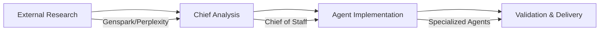
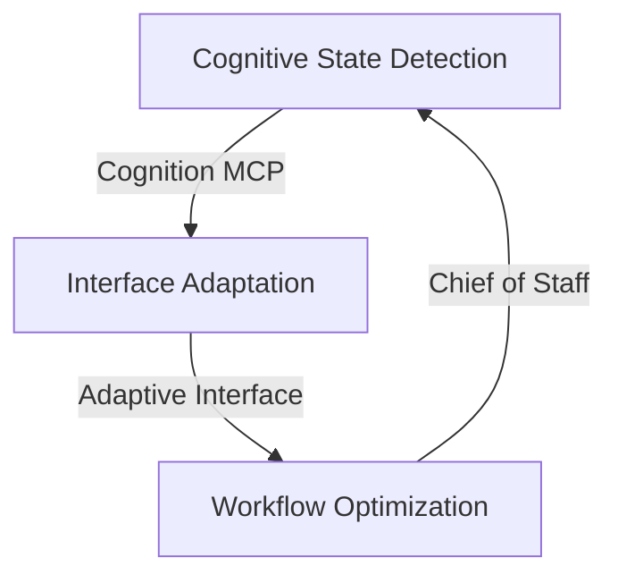
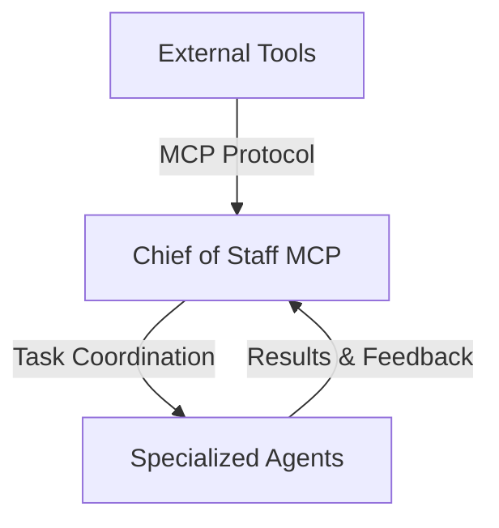

# 371-OS Agent Use Cases & Workflows

## 🎯 Primary Use Cases

### 1. Code Development & Architecture

**Primary Agents**: CTO Zara, Chief of Staff  
**Supporting**: CEO Mimi, Agent Factory  
**MCP Integration**: Cognition MCP, Documentation MCP

#### Workflow Commands
```bash
# Start development environment
bun nx serve cto-agent
bun nx serve chief-of-staff-agent

# External tool integration
# Genspark: Research latest architectural patterns
# Perplexity: Deep dive into specific technologies
# Comet Browser: Automated testing and deployment
```

#### Typical Workflow
1. **Architecture Planning** (CTO Zara)
   - Analyze requirements through Cognition MCP
   - Research patterns via Genspark integration
   - Generate technical specifications

2. **Development Coordination** (Chief of Staff)
   - Coordinate with external development tools
   - Manage cross-repository integration
   - Orchestrate build and deployment pipelines

3. **Code Review & Optimization** (CTO + External Tools)
   - Automated code analysis via Comet Browser
   - Research best practices via Perplexity
   - Generate improvement recommendations

#### Example Integration
```javascript
// Genspark → Chief of Staff → CTO Zara workflow
const architectureTask = {
  task: "Design microservices architecture for autonomous agent deployment",
  agents: ["cto", "chief_of_staff"],
  external_research: "genspark",
  deliverables: ["architecture_diagram", "implementation_plan", "deployment_strategy"]
};
```

### 2. Documentation & Knowledge Management

**Primary Agents**: Chief of Staff, CTO Zara  
**Supporting**: CAO Eduardo  
**MCP Integration**: Documentation MCP, Cognition MCP

#### Workflow Commands
```bash
# Start documentation workflow
bun nx serve chief-of-staff-agent
node core/mcp/documentation-mcp-server.js

# External integration for comprehensive documentation
# Perplexity: Research and fact-checking
# Genspark: Knowledge discovery and synthesis
```

#### Typical Workflow
1. **Content Planning** (Chief of Staff)
   - Analyze documentation needs
   - Coordinate with external research tools
   - Plan content structure and flow

2. **Research & Content Creation** (External Tools + Agents)
   - Perplexity: Deep research and fact verification
   - Genspark: Knowledge synthesis and insights
   - CAO Eduardo: Process documentation and workflows

3. **Review & Publication** (CTO + Documentation MCP)
   - Technical review and validation
   - Integration with existing knowledge base
   - Automated distribution and updates

#### Example Workflow
```bash
# Comprehensive documentation workflow
bun nx serve chief-of-staff-agent --mode=documentation
# → Coordinates Perplexity research
# → Integrates Genspark insights  
# → Manages content through Documentation MCP
# → Delivers structured, validated documentation
```

### 3. Creative Development & Content

**Primary Agents**: Cognitive Interface, Chief of Staff  
**Supporting**: CEO Mimi, CTO Zara  
**MCP Integration**: Cognition MCP (High-Level Access)

#### Workflow Commands
```bash
# Start creative environment
bun nx serve cognitive-interface
bun nx serve chief-of-staff-agent --mode=creative

# Cognitive state optimization
bun nx serve cognitive-engine
```

#### Typical Workflow
1. **Creative Mode Activation** (Cognitive Interface)
   - Detect user cognitive state via Cognition MCP
   - Adapt interface for creative workflows
   - Enable spatial creative environments

2. **Ideation & Concept Development** (Chief of Staff + External Tools)
   - Genspark: Trend analysis and inspiration
   - Perplexity: Research creative methodologies
   - Cognitive Interface: Adaptive creative tools

3. **Content Creation & Refinement** (Multi-Agent Coordination)
   - CEO Mimi: Strategic creative direction
   - CTO Zara: Technical implementation guidance
   - Chief of Staff: Workflow orchestration

#### Creative Spatial Environment
```bash
# Access Creator's Cosmos (Revolutionary spatial creative environment)
bun nx serve cognitive-interface --environment=creators_cosmos
# → Spatial content creation
# → AI-assisted ideation
# → Real-time collaboration with external tools
```

### 4. Prompts Management & Optimization

**Primary Agents**: Chief of Staff, Agent Factory  
**Supporting**: CTO Zara, CEO Mimi  
**MCP Integration**: Documentation MCP, Agent Registry

#### Workflow Commands
```bash
# Start prompt management workflow
bun nx serve agent-factory
bun nx serve chief-of-staff-agent --mode=prompts

# Agent definition management
# Location: libs/prompts/agent-definitions/
```

#### Typical Workflow
1. **Prompt Analysis** (Agent Factory + External Tools)
   - Abacus.ai: ML-powered prompt optimization
   - Perplexity: Research prompt engineering best practices
   - Agent Factory: Automated prompt testing

2. **Agent Tuning** (Chief of Staff Coordination)
   - Coordinate prompt updates across agents
   - Manage A/B testing of prompt variations
   - Track performance metrics and optimization

3. **Deployment & Monitoring** (Multi-Agent System)
   - CTO Zara: Technical validation and deployment
   - CEO Mimi: Strategic alignment verification
   - Chief of Staff: Performance monitoring and iteration

#### Prompt Optimization Pipeline
```bash
# Automated prompt optimization workflow
bun nx serve agent-factory --mode=optimization
# → Abacus.ai ML analysis
# → Perplexity research integration
# → Automated testing and validation
# → Performance tracking and iteration
```

### 5. Cleanup & Refactoring (371 Minds Repositories)

**Primary Agents**: CTO Zara, Chief of Staff  
**Supporting**: CFO Maya, CAO Eduardo  
**MCP Integration**: Documentation MCP, Code Analysis

#### Workflow Commands
```bash
# Start refactoring workflow
bun nx serve cto-agent --mode=refactoring
bun nx serve chief-of-staff-agent --mode=cleanup

# Repository analysis and optimization
bunx @biomejs/biome check --write .
bun nx affected --target=build
```

#### Typical Workflow
1. **Repository Analysis** (CTO + External Tools)
   - Comet Browser: Automated repository scanning
   - Genspark: Research refactoring patterns
   - CTO Zara: Technical debt assessment

2. **Cleanup Planning** (Multi-Agent Coordination)
   - CFO Maya: Cost-benefit analysis of refactoring
   - CAO Eduardo: Process optimization identification
   - Chief of Staff: Cross-repository coordination

3. **Implementation & Validation** (Coordinated Execution)
   - Automated cleanup via Comet Browser
   - Technical validation by CTO Zara
   - Documentation updates via Documentation MCP

#### Cross-Repository Coordination
```bash
# 371 Minds multi-repository refactoring
bun nx serve chief-of-staff-agent --mode=cross_repo
# → Coordinates across 371-Minds/os and 371-Minds/bizbuilderprompts
# → Manages dependency updates and compatibility
# → Ensures consistent patterns across repositories
```

## 🔄 Workflow Orchestration Patterns

### Pattern 1: Research → Analysis → Implementation


### Pattern 2: Cognitive-Aware Adaptation


### Pattern 3: Cross-Tool Integration


## 🚀 Quick Start Commands by Use Case

| Use Case | Quick Start Command | Key Integration |
|----------|---------------------|-----------------|
| **Code Development** | `bun nx serve cto-agent` | Genspark research + Comet automation |
| **Documentation** | `bun nx serve chief-of-staff-agent --mode=docs` | Perplexity research + Documentation MCP |
| **Creative Development** | `bun nx serve cognitive-interface` | Cognition MCP + spatial environments |
| **Prompts Management** | `bun nx serve agent-factory` | Abacus.ai ML + performance tracking |
| **Cleanup & Refactoring** | `bun nx serve cto-agent --mode=refactoring` | Comet automation + cross-repo coordination |

---

**💡 Pro Tip**: Start each workflow with `bun nx serve chief-of-staff-agent` to enable coordinated access to all external tools and agent capabilities!