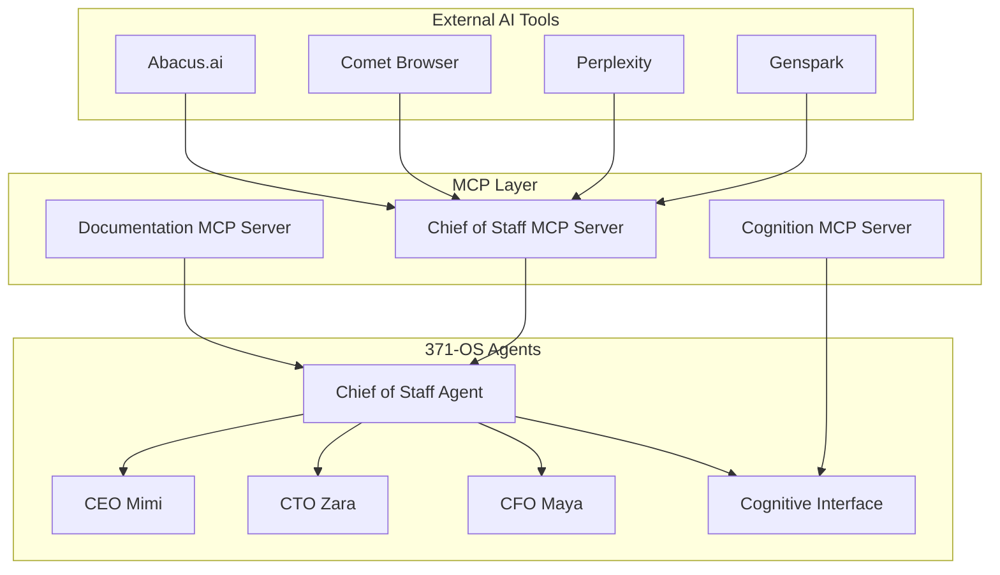

# MCP Integration Architecture - 371-OS

## 🧠 Chief of Staff as MCP Coordination Hub

The Chief of Staff agent serves as the central coordination point for all Model Context Protocol (MCP) interactions, bridging external AI tools with the 371-OS agent ecosystem.

### Architecture Overview



## 🔗 MCP Server Configurations

### Chief of Staff MCP Server
```json
{
  "name": "chief-of-staff-mcp",
  "version": "1.0.0",
  "description": "Central coordination hub for external AI tools",
  "server": {
    "command": "node",
    "args": ["core/mcp/chief-of-staff-mcp-server.js"],
    "env": {
      "MCP_SERVER_NAME": "chief-of-staff",
      "MCP_SERVER_VERSION": "1.0.0"
    }
  },
  "capabilities": {
    "resources": true,
    "tools": true,
    "prompts": true
  },
  "tools": [
    {
      "name": "coordinate_agents",
      "description": "Coordinate tasks across C-Suite agents",
      "inputSchema": {
        "type": "object",
        "properties": {
          "task": {"type": "string"},
          "agents": {"type": "array"},
          "priority": {"type": "string"}
        }
      }
    },
    {
      "name": "access_cognition",
      "description": "Access high-level cognitive state information",
      "inputSchema": {
        "type": "object", 
        "properties": {
          "cognitive_mode": {"type": "string"},
          "context": {"type": "object"}
        }
      }
    },
    {
      "name": "manage_workflow",
      "description": "Orchestrate complex multi-agent workflows",
      "inputSchema": {
        "type": "object",
        "properties": {
          "workflow_type": {"type": "string"},
          "steps": {"type": "array"},
          "timeline": {"type": "string"}
        }
      }
    }
  ]
}
```

### Cognition MCP Server (High-Level Access)
```json
{
  "name": "cognition-mcp",
  "version": "1.0.0", 
  "description": "High-level cognitive state access for AI coordination",
  "server": {
    "command": "node",
    "args": ["core/mcp/cognition-mcp-server.js"],
    "env": {
      "COGNITION_ACCESS_LEVEL": "high",
      "COGNITIVE_MODES": "executive,technical,creative"
    }
  },
  "capabilities": {
    "resources": true,
    "tools": true
  },
  "tools": [
    {
      "name": "detect_cognitive_state",
      "description": "Detect current cognitive state and mode",
      "inputSchema": {
        "type": "object",
        "properties": {
          "user_context": {"type": "object"},
          "task_type": {"type": "string"}
        }
      }
    },
    {
      "name": "adapt_interface",
      "description": "Adapt interface based on cognitive load",
      "inputSchema": {
        "type": "object",
        "properties": {
          "cognitive_load": {"type": "number"},
          "interface_mode": {"type": "string"}
        }
      }
    },
    {
      "name": "coordinate_modes",
      "description": "Coordinate mode transitions across agents",
      "inputSchema": {
        "type": "object",
        "properties": {
          "target_mode": {"type": "string"},
          "affected_agents": {"type": "array"}
        }
      }
    }
  ]
}
```

## 🤖 External AI Tool Integration

### Genspark Integration
```javascript
// Example: Genspark → Chief of Staff MCP
const mcpClient = new MCPClient('mcp://chief-of-staff');

await mcpClient.callTool('coordinate_agents', {
  task: 'Research market trends for AI agent deployment',
  agents: ['ceo', 'cto', 'cfo'],
  priority: 'high'
});
```

### Perplexity Integration
```javascript
// Example: Perplexity → Documentation MCP → Chief of Staff
const response = await mcpClient.callTool('access_cognition', {
  cognitive_mode: 'research',
  context: {
    topic: 'autonomous agent architectures',
    depth: 'comprehensive'
  }
});
```

### Comet Browser Integration
```javascript
// Example: Web automation through Chief of Staff
await mcpClient.callTool('manage_workflow', {
  workflow_type: 'web_automation',
  steps: [
    'navigate_to_target',
    'extract_data', 
    'analyze_with_agents',
    'generate_report'
  ],
  timeline: '30_minutes'
});
```

### Abacus.ai Integration
```javascript
// Example: ML model coordination
await mcpClient.callTool('coordinate_agents', {
  task: 'Analyze ML model performance and suggest optimizations',
  agents: ['cto', 'cfo'],
  priority: 'medium'
});
```

## 🚀 Setup Instructions

### 1. Start MCP Servers
```bash
# Start all MCP servers
powershell -ExecutionPolicy Bypass -File core/mcp/start-mcp-servers.ps1

# Or start individually
node core/mcp/chief-of-staff-mcp-server.js &
node core/mcp/cognition-mcp-server.js &
node core/mcp/documentation-mcp-server.js &
```

### 2. Configure External Tools
```bash
# Add MCP server configurations to external tools
# Example for Claude Desktop (if using)
# Add to ~/.config/claude-desktop/config.json
```

### 3. Start Chief of Staff Agent
```bash
# Start with MCP coordination enabled
bun nx serve chief-of-staff-agent --mcp-enabled

# Verify MCP connections
node core/mcp/test-mcp-connection.js
```

### 4. Test Integration
```bash
# Test external tool connectivity
node core/mcp/test-external-integration.js

# Monitor MCP traffic
node core/mcp/monitor-mcp-traffic.js
```

## 🔧 Configuration Files

### MCP Client Configuration (for external tools)
```json
{
  "mcpServers": {
    "chief-of-staff": {
      "command": "node",
      "args": ["core/mcp/chief-of-staff-mcp-server.js"],
      "cwd": "/path/to/371-os"
    },
    "cognition": {
      "command": "node", 
      "args": ["core/mcp/cognition-mcp-server.js"],
      "cwd": "/path/to/371-os"
    }
  }
}
```

### Standalone Mode Configuration
```json
{
  "standalone_mode": {
    "enabled": true,
    "mcp_servers": ["chief-of-staff", "cognition"],
    "external_api": true,
    "authentication": {
      "type": "token",
      "token_env": "STANDALONE_API_TOKEN"
    },
    "ports": {
      "chief_of_staff": 3001,
      "cognition": 3002,
      "api_gateway": 3000
    }
  }
}
```

## 📊 Monitoring & Analytics

### MCP Traffic Monitoring
```bash
# Real-time MCP traffic analysis
node core/mcp/monitor-traffic.js

# Performance metrics
node core/mcp/performance-metrics.js

# Usage analytics
node core/mcp/usage-analytics.js
```

### Integration Health Checks
```bash
# Check all MCP server health
node core/mcp/health-check-all.js

# Test external tool connectivity
node core/mcp/test-external-connectivity.js

# Validate agent coordination
node core/mcp/validate-agent-coordination.js
```

---

**🎯 Key Benefits**: This architecture enables seamless integration of external AI tools (Genspark, Perplexity, Comet, Abacus.ai) with the 371-OS agent ecosystem through the Chief of Staff coordination hub, providing high-level cognitive access and intelligent workflow orchestration.