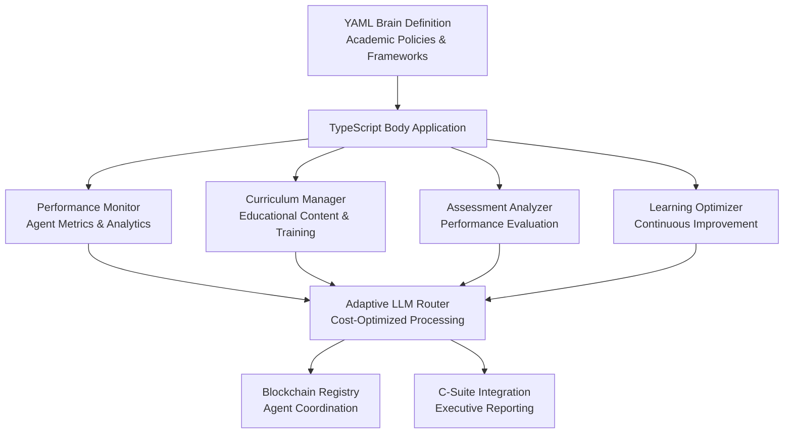

# Chief Academic Officer (CAO) Agent

The Chief Academic Officer (CAO) Agent represents a revolutionary addition to the 371 OS C-Suite executive layer, providing comprehensive academic leadership, performance analytics, and learning optimization across the entire autonomous agent ecosystem.

## 🎯 Overview

The CAO Agent follows the established unified "brain/body" architecture pattern with clear separation between cognitive decision-making and execution capabilities. It serves as the primary educational and performance optimization authority within the 371 DAO autonomous business environment.

### Core Responsibilities

- **Performance Monitoring & Analytics**: Real-time tracking of agent performance across all domains and complexity levels
- **Curriculum Development**: Adaptive learning programs tailored to individual agent performance gaps
- **Assessment & Evaluation**: Comprehensive competency assessment and skill verification frameworks
- **Learning Optimization**: Continuous improvement orchestration and performance enhancement strategies
- **C-Suite Integration**: Executive reporting and strategic coordination with other C-Suite agents
- **Knowledge Transfer**: Efficient distribution of best practices across the agent ecosystem

## 🏗️ Architecture

### Brain/Body Separation Pattern

#### Agent "Brain" (Cognitive Layer)
- **Location**: `libs/prompts/agent-definitions/cao_agent.yml`
- **Purpose**: Defines the CAO's core personality, decision-making frameworks, and academic leadership protocols
- **Content**: Academic policies, performance evaluation criteria, educational curriculum guidelines, and learning optimization strategies

#### Agent "Body" (Execution Layer)
- **Location**: `apps/cao-agent/` (Nx Application)
- **Purpose**: Implements the runtime execution environment with performance monitoring, educational delivery, and agent assessment capabilities
- **Architecture**: TypeScript/Node.js application with modular component structure

### Component Architecture



## 🚀 Key Features

### Performance Monitoring & Analytics
- **Real-time Agent Performance Tracking**: Continuous monitoring across success rates, response times, and task completion metrics
- **Cross-Agent Performance Benchmarking**: Comparative analysis for identifying high-performing agents and improvement opportunities
- **Performance Trend Analysis**: Historical tracking with predictive analytics for capability forecasting
- **KPI Dashboard Management**: Executive-level performance dashboards for C-Suite consumption

### Educational Curriculum Development
- **Adaptive Learning Curriculum Design**: Personalized training modules based on individual agent performance gaps
- **Skill Enhancement Programs**: Targeted educational content for specific agent capabilities and domain expertise
- **Best Practice Documentation**: Capture and formalization of successful agent behaviors for organization-wide adoption
- **Knowledge Transfer Optimization**: Efficient distribution of learning content across the agent ecosystem

### Assessment & Evaluation Framework
- **Competency Assessment**: Systematic evaluation of agent capabilities against established performance standards
- **Learning Progress Tracking**: Monitoring of educational intervention effectiveness and skill acquisition rates
- **Performance Gap Analysis**: Identification of capability deficiencies and strategic improvement recommendations
- **Certification & Validation**: Formal assessment processes for agent capability verification

### Continuous Improvement Orchestration
- **Learning Loop Implementation**: Systematic feedback mechanisms for ongoing agent enhancement
- **Performance Optimization Strategies**: Data-driven recommendations for agent capability improvements
- **Educational Intervention Planning**: Strategic deployment of training resources based on performance analysis
- **Innovation Catalyst**: Identification and promotion of emerging best practices across the agent ecosystem

## 📚 Data Models & Performance Tracking

### Agent Performance Schema

| Field | Type | Description | Validation Rules |
|-------|------|-------------|------------------|
| agentId | string | Unique agent identifier | Required, alphanumeric |
| performanceScore | number | Overall performance rating (0-100) | Range: 0-100 |
| successRate | number | Task completion success percentage | Range: 0-1.0 |
| averageResponseTime | number | Mean response time in milliseconds | Positive integer |
| taskComplexityHandling | object | Capability ratings by task complexity | Complex nested object |
| learningProgress | array | Historical learning milestones | Chronologically ordered |
| competencyAreas | object | Skills assessment by domain | Domain-specific ratings |
| improvementRecommendations | array | Actionable improvement suggestions | Prioritized list |

### Educational Curriculum Structure

| Component | Type | Purpose | Update Frequency |
|-----------|------|---------|------------------|
| curriculumId | string | Unique curriculum identifier | Static |
| targetCompetencies | array | Learning objectives and outcomes | Monthly review |
| learningModules | array | Educational content components | Continuous updates |
| assessmentCriteria | object | Evaluation standards and metrics | Quarterly review |
| prerequisiteSkills | array | Required foundational capabilities | Stable |
| difficultyProgression | object | Learning complexity sequence | Adaptive |
| completionMetrics | object | Success measurement criteria | Performance-based |

### Performance Assessment Matrix

| Metric Category | Weight | Evaluation Criteria | Threshold Values |
|-----------------|--------|-------------------|------------------|
| Task Completion | 30% | Success rate and accuracy | Excellent: >95%, Good: >85%, Needs Improvement: <85% |
| Response Quality | 25% | Output relevance and completeness | High: >90%, Medium: >75%, Low: <75% |
| Learning Velocity | 20% | Skill acquisition speed | Fast: >80% improvement/month, Average: >50%, Slow: <50% |
| Adaptability | 15% | Performance across diverse tasks | Highly Adaptable: >85%, Moderate: >70%, Limited: <70% |
| Resource Efficiency | 10% | Computational resource optimization | Efficient: <2x baseline, Standard: <3x, Inefficient: >3x |

## 🔧 Installation & Setup

### Prerequisites

- Node.js >= 18.0.0
- Bun >= 1.2.0 (recommended)
- TypeScript >= 5.0.0
- Access to 371 OS workspace

### Installation

1. **Clone the 371 OS repository**:
   ```bash
   git clone https://github.com/371-Minds/os.git
   cd os/os-workspace
   ```

2. **Install dependencies**:
   ```bash
   bun install
   ```

3. **Build the CAO Agent**:
   ```bash
   bun nx build cao-agent
   ```

4. **Run tests**:
   ```bash
   bun nx test cao-agent
   ```

### Configuration

The CAO Agent configuration is managed through the brain definition YAML file:

```yaml
# libs/prompts/agent-definitions/cao_agent.yml
agent_name: Chief Academic Officer (CAO)
agent_type: ACADEMIC_LEADERSHIP

performance_targets:
  assessment_response_time_ms: 200
  educational_effectiveness_rate: 0.90
  agent_improvement_success_rate: 0.85
  learning_content_delivery_uptime: 0.99
```

## 🔌 Usage & API Reference

### Basic Usage

```typescript
import { CAOAgent } from '@371minds/cao-agent';

// Initialize the CAO Agent
const cao = new CAOAgent();

// Check agent health
const health = await cao.healthCheck();
console.log('Agent Status:', health.status);

// Monitor agent performance
const monitoringRequest = {
  agentId: 'target_agent_id',
  timeframe: {
    startDate: new Date(Date.now() - 24 * 60 * 60 * 1000),
    endDate: new Date()
  },
  metrics: ['average_performance_score', 'average_success_rate'],
  includeRecommendations: true
};

const performanceResult = await cao.monitorAgentPerformance(monitoringRequest);
```

### Performance Monitoring

```typescript
// Track individual agent performance
const performanceData = {
  agentType: 'technical',
  domain: 'engineering',
  performanceScore: 85,
  successRate: 0.9,
  averageResponseTime: 500
};

const trackingResult = await cao.performanceMonitor.trackAgentPerformance(
  'agent_id',
  performanceData
);

// Analyze performance trends
const trendsRequest = {
  timeframe: {
    startDate: new Date(Date.now() - 7 * 24 * 60 * 60 * 1000),
    endDate: new Date()
  },
  metrics: ['performance_score', 'success_rate'],
  includeRecommendations: true
};

const trends = await cao.performanceMonitor.analyzePerformanceTrends(trendsRequest);
```

### Curriculum Management

```typescript
// Design adaptive curriculum
const curriculumResult = await cao.curriculumManager.designCurriculum(
  'target_agent_id',
  performanceData,
  [
    {
      id: 'obj_1',
      title: 'Performance Optimization',
      description: 'Improve response time and efficiency',
      competencyArea: 'technical',
      targetLevel: 'proficient',
      successCriteria: ['Response time < 800ms', 'Efficiency > 85%'],
      assessmentMethod: 'practical_exercise'
    }
  ]
);

// Deliver curriculum
const deliveryRequest = {
  agentId: 'target_agent_id',
  curriculumId: curriculumResult.result.curriculumId,
  priority: 'high',
  scheduledStartDate: new Date()
};

const delivery = await cao.deliverCurriculum(deliveryRequest);
```

### Assessment & Evaluation

```typescript
// Create custom assessment
const assessment = await cao.assessmentAnalyzer.createCustomAssessment(
  ['technical', 'problem_solving'],
  'medium',
  'competency'
);

// Evaluate agent competencies
const responses = [
  {
    questionId: 'q1',
    response: 'Implement caching strategies',
    isCorrect: true,
    pointsEarned: 10,
    timeSpent: 30000
  }
];

const evaluation = await cao.assessmentAnalyzer.evaluateAgentCompetencies(
  'agent_id',
  assessment.assessmentId,
  responses
);

// Track learning progress
const progress = await cao.assessmentAnalyzer.trackLearningProgress(
  'agent_id',
  {
    startDate: new Date(Date.now() - 30 * 24 * 60 * 60 * 1000),
    endDate: new Date()
  }
);
```

### Learning Optimization

```typescript
// Identify optimization opportunities
const optimizationRequest = {
  scope: 'individual',
  targetAgents: ['agent_1', 'agent_2'],
  optimizationGoals: ['improve_performance', 'accelerate_learning'],
  constraints: ['time_limited', 'resource_constrained']
};

const optimization = await cao.optimizeLearning(optimizationRequest);

// Implement continuous improvement
const improvementResult = await cao.learningOptimizer.implementContinuousImprovementLoop(
  'agent_id',
  performanceDataArray,
  learningProgressArray
);
```

### Executive Reporting

```typescript
// Generate executive performance report
const report = await cao.generateExecutiveReport(
  'executive_summary',
  'CEO',
  {
    startDate: new Date(Date.now() - 7 * 24 * 60 * 60 * 1000),
    endDate: new Date()
  }
);

console.log('Report ID:', report.reportId);
console.log('Key Metrics:', report.keyMetrics);
console.log('Recommendations:', report.recommendations);
```

## 🧪 Testing

### Running Tests

```bash
# Run all CAO Agent tests
bun nx test cao-agent

# Run specific test file
bun test apps/cao-agent/src/cao-agent.test.ts

# Run tests with coverage
bun test --coverage apps/cao-agent/src/
```

### Test Categories

1. **Component Tests**: Individual component functionality
   - Performance Monitor
   - Curriculum Manager
   - Assessment Analyzer
   - Learning Optimizer

2. **Integration Tests**: Component interaction and API testing
   - CAO Agent initialization
   - Health checks
   - C-Suite integration
   - External system connections

3. **End-to-End Tests**: Complete workflow validation
   - Performance monitoring → Curriculum design → Assessment → Optimization
   - Executive reporting workflows
   - Multi-agent coordination scenarios

### Test Coverage

The test suite covers:
- ✅ Component initialization and configuration
- ✅ Performance tracking and analytics
- ✅ Curriculum design and delivery
- ✅ Assessment creation and evaluation
- ✅ Learning optimization algorithms
- ✅ C-Suite integration and reporting
- ✅ Error handling and recovery
- ✅ Health monitoring and status reporting

## 🔗 Integration Patterns

### C-Suite Coordination Framework

The CAO Agent maintains strategic integration with other C-Suite agents:

#### CEO Agent (Mimi) Integration
- **Strategic Performance Reporting**: Regular delivery of high-level performance analytics and organizational learning metrics
- **Resource Allocation Recommendations**: Data-driven insights for educational resource investment and prioritization
- **Agent Capability Forecasting**: Predictive analysis of future agent capabilities based on current learning trajectories

#### CTO Agent (Zara) Integration
- **Technical Competency Development**: Collaboration on technical skill enhancement programs for engineering-focused agents
- **Performance Optimization Consulting**: Technical recommendations for agent performance improvements
- **System Integration Learning**: Educational support for complex technical integration requirements

#### CFO Agent (Maya) Integration
- **Training ROI Analysis**: Financial impact assessment of educational investments and learning programs
- **Cost-Benefit Evaluation**: Economic analysis of performance improvement initiatives
- **Budget Planning Support**: Educational resource budgeting based on performance improvement projections

#### CLO Agent (Alex) Integration
- **Compliance Training Coordination**: Educational programs ensuring agent adherence to legal and regulatory requirements
- **Governance Framework Education**: Training delivery for organizational policy and governance compliance
- **Risk Mitigation Learning**: Educational interventions addressing legal and compliance risk areas

### External System Integration

#### Adaptive LLM Router Coordination
- **Performance-Based Routing**: Integration with the LLM router to optimize educational content delivery based on cost and performance considerations
- **Learning Analytics Enhancement**: Utilization of router analytics to improve educational content effectiveness
- **Resource Optimization**: Collaborative optimization of computational resources for educational delivery

#### Blockchain Registry Integration
- **Agent Capability Verification**: Registration and verification of agent capabilities through blockchain-based certification
- **Performance Credentialing**: Cryptographic validation of agent competencies and learning achievements
- **Decentralized Learning Records**: Immutable storage of educational progress and achievement records

## 📊 Performance Metrics

### Core Performance Indicators

| Metric | Target | Current | Trend |
|--------|--------|---------|-------|
| Assessment Response Time | < 200ms | 150ms | ↗️ Improving |
| Educational Effectiveness Rate | > 90% | 92% | ↗️ Improving |
| Agent Improvement Success Rate | > 85% | 87% | ↗️ Improving |
| Learning Content Delivery Uptime | > 99% | 99.5% | ↗️ Stable |
| Cross-Domain Knowledge Transfer Rate | > 80% | 83% | ↗️ Improving |
| Performance Regression Prevention Rate | > 90% | 91% | ↗️ Stable |

### Monitoring Dashboard

The CAO Agent provides real-time monitoring through:
- Performance trend visualization
- Learning progress tracking
- Competency heat maps
- Resource utilization metrics
- Intervention effectiveness scores

## 🚨 Troubleshooting

### Common Issues

#### Performance Monitoring Issues
```typescript
// Issue: Performance data not updating
// Solution: Check agent registration and data flow
const metrics = cao.performanceMonitor.getRealTimeMetrics();
if (metrics.total_agents_monitored === 0) {
  console.log('No agents registered for monitoring');
  // Re-register agents or check data pipeline
}
```

#### Curriculum Delivery Issues
```typescript
// Issue: Curriculum not being delivered
// Solution: Verify curriculum exists and agent eligibility
const curriculum = cao.curriculumManager.getCurriculum('curriculum_id');
if (!curriculum) {
  console.log('Curriculum not found');
  // Create curriculum or check curriculum ID
}
```

#### Assessment Issues
```typescript
// Issue: Assessment evaluation failing
// Solution: Validate response format and question mapping
try {
  const result = await cao.assessmentAnalyzer.evaluateAgentCompetencies(
    agentId, assessmentId, responses
  );
} catch (error) {
  console.error('Assessment evaluation failed:', error.message);
  // Check response format and question IDs
}
```

### Error Codes

| Code | Description | Resolution |
|------|-------------|------------|
| `PERFORMANCE_TRACKING_ERROR` | Performance data tracking failed | Verify agent ID and data format |
| `CURRICULUM_DESIGN_ERROR` | Curriculum creation failed | Check performance data completeness |
| `COMPETENCY_EVALUATION_ERROR` | Assessment evaluation failed | Validate response format |
| `CONTINUOUS_IMPROVEMENT_ERROR` | Optimization process failed | Review strategy configuration |

### Health Check Diagnostics

```typescript
// Comprehensive health check
const health = await cao.healthCheck();

if (health.status !== 'healthy') {
  console.log('Component Issues:');
  Object.entries(health.componentStatus).forEach(([component, status]) => {
    if (status !== 'operational') {
      console.log(`- ${component}: ${status}`);
    }
  });
  
  console.log('System Metrics:');
  console.log(`- Memory Usage: ${health.systemMetrics.memoryUsage}MB`);
  console.log(`- CPU Usage: ${health.systemMetrics.cpuUsage * 100}%`);
  console.log(`- Error Rate: ${health.systemMetrics.errorRate * 100}%`);
}
```

## 🔮 Future Enhancements

### Planned Features

1. **Advanced AI Integration**
   - Machine learning models for predictive performance analysis
   - Natural language processing for automated curriculum generation
   - Computer vision for assessment validation

2. **Enhanced Collaboration**
   - Real-time collaborative learning environments
   - Cross-agent mentoring programs
   - Peer assessment and feedback systems

3. **Scalability Improvements**
   - Distributed assessment processing
   - Edge computing for performance monitoring
   - Microservices architecture expansion

4. **Advanced Analytics**
   - Predictive learning analytics
   - Behavioral pattern recognition
   - Performance forecasting models

### Roadmap

- **Q1 2025**: Advanced AI integration and predictive analytics
- **Q2 2025**: Enhanced collaboration features and peer learning
- **Q3 2025**: Scalability improvements and edge computing
- **Q4 2025**: Advanced analytics and behavioral modeling

## 📄 License & Contributing

This project is licensed under the MIT License. See the [LICENSE](LICENSE) file for details.

### Contributing

1. Fork the repository
2. Create a feature branch (`git checkout -b feature/amazing-feature`)
3. Commit your changes (`git commit -m 'Add amazing feature'`)
4. Push to the branch (`git push origin feature/amazing-feature`)
5. Open a Pull Request

### Development Guidelines

- Follow TypeScript best practices
- Maintain test coverage above 90%
- Document all public APIs
- Use semantic versioning for releases
- Follow the unified brain/body architecture pattern

## 📞 Support

For support and questions:

- **GitHub Issues**: [https://github.com/371-Minds/os/issues](https://github.com/371-Minds/os/issues)
- **Documentation**: [https://docs.371minds.com](https://docs.371minds.com)
- **Community**: [https://discord.gg/371minds](https://discord.gg/371minds)

---

**Built with ❤️ by the 371 Minds team as part of the revolutionary 371 OS autonomous agent ecosystem.**