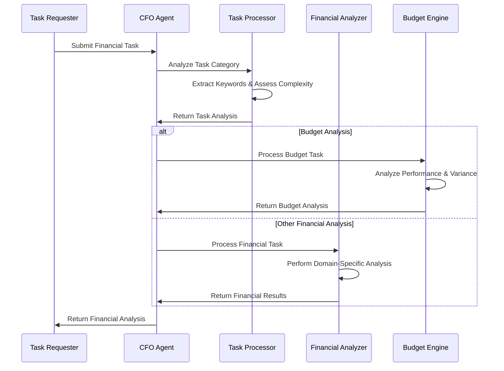

# CFO Agent (Maya) - Financial Leadership and Analysis

Maya is the Chief Financial Officer agent for the 371 DAO, providing comprehensive financial leadership, budget analysis, cost optimization, ROI assessment, and strategic financial decision-making capabilities.

## Overview

Maya follows the unified "brain/body" architecture pattern established in the 371 OS ecosystem, with her personality and capabilities defined in a centralized YAML configuration and her execution runtime implemented in TypeScript. This separation enables flexible agent behavior modification while maintaining robust execution capabilities.

## Architecture

### Agent Brain
- **Location**: `libs/prompts/agent-definitions/maya_cfo.yml`
- **Purpose**: Centralized configuration defining Maya's personality, financial expertise, decision framework, and behavioral patterns
- **Key Features**: Financial domain expertise, risk-aware decision making, performance-oriented approach

### Agent Body
- **Location**: `apps/cfo-agent/src/`
- **Purpose**: TypeScript execution runtime providing financial analysis capabilities
- **Core Components**:
  - `CFOAgent` - Main agent class with task processing and coordination
  - `FinancialTaskProcessor` - Intelligent task categorization and analysis
  - `FinancialAnalyzer` - Multi-domain financial analysis engine
  - `BudgetAnalysisEngine` - Specialized budget performance analysis

## Financial Capabilities

### Budget Analysis & Optimization
- Comprehensive budget performance evaluation
- Variance analysis with root cause identification
- Optimization opportunity identification
- Forecast adjustments and recommendations

### Cost Optimization & Savings Identification
- Systematic cost structure analysis
- Savings opportunity prioritization
- Implementation planning with risk assessment
- ROI projections for optimization initiatives

### ROI Assessment & Investment Analysis
- Financial metrics calculation (ROI, NPV, IRR, Payback Period)
- Multi-scenario analysis with risk adjustment
- Investment recommendations with confidence scoring
- Sensitivity analysis for key variables

### Financial Reporting & Analytics
- Executive summary generation
- Key performance indicator tracking
- Trend analysis and benchmarking
- Detailed financial statement analysis

### Revenue Forecasting & Projections
- Historical trend analysis
- Market-driven forecasting models
- Scenario planning with confidence intervals
- Revenue driver identification and impact analysis

## Technical Implementation

### Task Processing Workflow


### Performance Targets
- **Response Time**: <1000ms for standard analysis
- **Decision Confidence**: >85% for recommendations
- **Budget Variance Detection**: 95% accuracy
- **Forecast Accuracy**: >90% for revenue projections

## Usage Examples

### Budget Analysis
```typescript
const cfoAgent = new CFOAgent();

const budgetTask = {
  id: 'budget-q4-2024',
  title: 'Q4 Budget Performance Analysis',
  description: 'Budget: $250,000, Actual: $235,000, Period: Q4-2024',
  category: 'budget_analysis',
  priority: 'high',
  requestedBy: 'finance-team',
  createdAt: new Date()
};

const result = await cfoAgent.processTask(budgetTask);
console.log('Variance:', result.result.budgetPerformance.variancePercentage);
console.log('Recommendations:', result.result.recommendations.length);
```

### Cost Optimization
```typescript
const costTask = {
  id: 'cost-opt-2024',
  title: 'Annual Cost Optimization Review',
  description: 'Analyze $500,000 operational budget for savings opportunities',
  category: 'cost_optimization',
  priority: 'medium',
  requestedBy: 'operations',
  createdAt: new Date()
};

const result = await cfoAgent.optimizeCosts(costTask.description);
console.log('Savings Potential:', result.expectedSavings.total);
console.log('Opportunities:', result.optimizationOpportunities.length);
```

### ROI Assessment
```typescript
const investmentTask = {
  id: 'roi-tech-2024',
  title: 'Technology Investment ROI',
  description: 'Evaluate $150,000 technology infrastructure investment',
  category: 'roi_assessment',
  priority: 'high',
  requestedBy: 'cto',
  createdAt: new Date()
};

const result = await cfoAgent.assessROI(investmentTask.description);
console.log('ROI:', result.financialMetrics.roi);
console.log('Recommendation:', result.recommendation.decision);
```

## Testing

Run the comprehensive test suite to validate functionality:

```bash
# Run all tests
bun test

# Run specific test categories
bun test --grep "Budget Analysis"
bun test --grep "Cost Optimization"
bun test --grep "ROI Assessment"

# Run with coverage
bun test --coverage
```

### Test Coverage
- ✅ Agent initialization and configuration loading
- ✅ Financial task processing across all categories
- ✅ Component validation and health checks
- ✅ Performance targets and error handling
- ✅ Integration workflows and escalation logic

## Integration

### Router Integration
Maya integrates seamlessly with the Intelligent Router for task distribution:

```typescript
// Router capability registration
const capabilities = cfoAgent.getCapabilities();
router.registerAgent('maya-cfo', capabilities);

// Task routing
const result = await router.routeTask(financialTask);
```

### Health Monitoring
```typescript
const healthCheck = await cfoAgent.healthCheck();
console.log('Status:', healthCheck.status);
console.log('Components:', healthCheck.checks.map(c => c.component));
```

## Configuration

### Environment Variables
- `CFO_AGENT_LOG_LEVEL` - Logging verbosity (debug, info, warn, error)
- `CFO_AGENT_CACHE_TTL` - Analysis cache time-to-live in seconds
- `CFO_AGENT_MAX_CONCURRENT` - Maximum concurrent task processing

### Performance Tuning
- Adjust variance thresholds in `BudgetAnalysisEngine`
- Modify confidence scoring in `FinancialTaskProcessor`
- Configure benchmark data in `FinancialAnalyzer`

## Development

### Project Structure
```
apps/cfo-agent/
├── src/
│   ├── index.ts                    # Main CFO Agent class
│   ├── types.ts                    # TypeScript type definitions
│   ├── financial-task-processor.ts # Task categorization and analysis
│   ├── financial-analyzer.ts       # Multi-domain financial analysis
│   ├── budget-analysis-engine.ts   # Specialized budget analysis
│   └── index.test.ts              # Comprehensive test suite
├── project.json                   # Nx project configuration
├── package.json                   # Package dependencies
├── tsconfig.json                  # TypeScript configuration
└── README.md                      # This documentation
```

### Building and Running
```bash
# Build the CFO agent
bun nx build cfo-agent

# Run in development mode
bun nx serve cfo-agent

# Run tests
bun nx test cfo-agent

# Lint code
bun nx lint cfo-agent
```

## Future Enhancements

### Planned Features
- [ ] Machine learning model integration for predictive analytics
- [ ] Real-time financial data source connections
- [ ] Advanced visualization and dashboard capabilities
- [ ] Multi-currency and international financial standards support
- [ ] Integration with external financial systems and APIs

### Performance Optimizations
- [ ] Caching layer for frequently accessed analysis results
- [ ] Parallel processing for complex multi-domain analysis
- [ ] Streaming analysis for large datasets
- [ ] GPU acceleration for intensive calculations

## Contributing

When contributing to Maya's development:

1. **Follow the unified architecture pattern** - Maintain separation between brain (YAML) and body (TypeScript)
2. **Maintain test coverage** - Ensure all new functionality includes comprehensive tests
3. **Document financial logic** - Clearly explain calculation methods and decision criteria
4. **Performance considerations** - Maintain response time targets and memory efficiency
5. **Security compliance** - Follow zero-trust principles for financial data handling

## Support

For issues, questions, or contributions:
- Review the comprehensive test suite for usage examples
- Check the troubleshooting section in the main 371 OS documentation
- Consult the financial analysis methodology documentation
- Verify performance metrics against established targets

Maya represents the cutting edge of autonomous financial leadership, combining deep financial expertise with intelligent automation to drive strategic decision-making in the 371 DAO ecosystem.