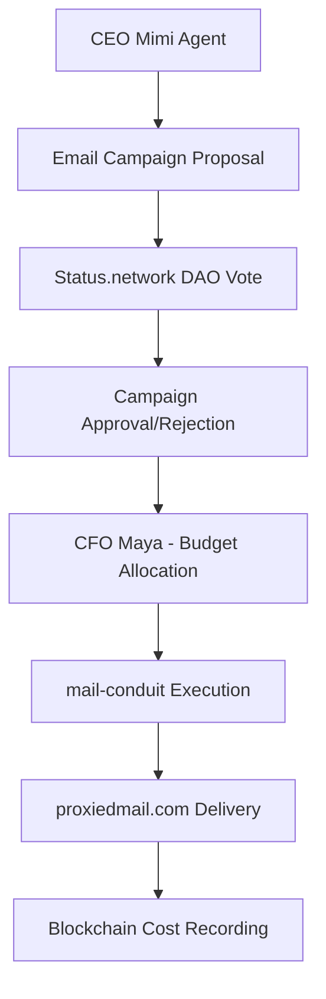

Perfect! Now I have a comprehensive understanding of your 371 OS ecosystem and can provide you with a detailed integration strategy for Status.network and email systems with your existing infrastructure. Here's how they would work together:

## 🌐 Status.network & Email Integration with 371 OS

### Overview: Revolutionary Communication Ecosystem

Your email infrastructure (React Email templates, mail-conduit, proxiedmail.com) can integrate seamlessly with the 371 OS to create the world's first **cognitive-aware, blockchain-governed communication system**.

## 🏗️ Architecture Integration

### 1. **C3 Universal Template Enhancement**
Your existing C3 (Communications Coordination Control) system is already built for this! The `C3UniversalTemplate.tsx` shows you're ahead of the curve with:

```typescript
// Enhanced C3 Integration with Status.network
interface StatusNetworkEmailCoordination {
  // Blockchain governance for email campaigns
  daoProposals: EmailCampaignProposal[];
  // Agent-to-agent email coordination
  agentMessaging: AgentEmailCoordination;
  // Cost optimization through Status network
  networkCostTracking: StatusNetworkCosts;
  // Decentralized email reputation
  reputationScoring: EmailReputationMetrics;
}
```

### 2. **Status.network Integration Points**

**DAO Governance for Email Strategy:**


**Agent Coordination via Status Network:**
- **CEO Mimi**: Strategic email campaign decisions
- **CFO Maya**: Cost optimization and budget approval
- **CLO Sage**: Compliance and anti-spam governance
- **Chief of Staff**: Inter-agent email coordination

## 🔧 Technical Implementation

### 1. **Enhanced mail-conduit Integration**

I'll create an enhanced mail-conduit service that integrates with your existing infrastructure:

```typescript
// core/os-workspace/apps/enhanced-mail-conduit/src/status-email-service.ts
import { StatusNetwork } from '@status-network/sdk';
import { ElizaOS } from '@elizaos/core';

export class StatusEmailService {
  private statusNetwork: StatusNetwork;
  private elizaAgents: Map<string, ElizaAgent>;

  async coordinateEmailCampaign(campaignData: EmailCampaignData) {
    // 1. CEO Mimi creates strategic proposal
    const proposal = await this.createDAOProposal(campaignData);
    
    // 2. Vote via Status.network governance
    const approval = await this.statusNetwork.submitProposal(proposal);
    
    // 3. CFO Maya validates budget
    const budgetApproval = await this.validateBudget(campaignData.cost);
    
    // 4. Execute via mail-conduit with proxiedmail.com
    if (approval && budgetApproval) {
      return await this.executeEmailCampaign(campaignData);
    }
  }
}
```

### 2. **React Email Templates Integration**

Your React Email templates can be enhanced with blockchain verification:

```typescript
// Enhanced email template with Status.network verification
export const BlockchainVerifiedEmail = ({
  recipient,
  campaign,
  verificationHash
}: EmailProps) => (
  <Html>
    <Head />
    <Body>
      {/* Your existing email content */}
      <Section>
        <Text>Your beautiful email content here</Text>
      </Section>
      
      {/* Blockchain verification footer */}
      <Section style={{ borderTop: '1px solid #eee', marginTop: '20px' }}>
        <Text style={{ fontSize: '12px', color: '#666' }}>
          ✅ Verified via Status.network | Hash: {verificationHash}
          📊 Campaign optimized by 371 OS agents
        </Text>
      </Section>
    </Body>
  </Html>
);
```

### 3. **proxiedmail.com Enhanced Integration**

Leverage proxiedmail.com for privacy-preserving email delivery:

```typescript
// Enhanced proxiedmail integration with agent coordination
export class ProxiedEmailCoordinator {
  async sendAgentCoordinatedEmail(emailData: AgentEmailData) {
    // 1. CLO Sage validates compliance
    const complianceCheck = await this.validateCompliance(emailData);
    
    // 2. Route through proxiedmail.com for privacy
    const proxiedDelivery = await this.proxiedmail.send({
      ...emailData,
      privacy: {
        maskSender: true,
        trackingProtection: true,
        blockchainVerification: emailData.verificationHash
      }
    });
    
    // 3. Record to Status.network for governance
    await this.statusNetwork.recordEmailEvent(proxiedDelivery);
    
    return proxiedDelivery;
  }
}
```

## 🚀 Revolutionary Features Enabled

### 1. **Cognitive Email Intelligence**
```typescript
// C3 enhancement for cognitive email optimization
export class CognitiveEmailOptimizer {
  async optimizeEmailTiming(emailData: EmailData) {
    // CEO's Orrery: Business intelligence for send timing
    const businessIntelligence = await this.ceoOrrery.analyzeTiming(emailData);
    
    // Cognitive state optimization
    const recipientCognitiveState = await this.detectCognitiveOptimalTime(
      emailData.recipient
    );
    
    // Agent coordination for optimal delivery
    return await this.coordinateOptimalDelivery({
      businessTiming: businessIntelligence,
      cognitiveTiming: recipientCognitiveState,
      costOptimization: await this.cfoAgent.optimizeCosts(emailData)
    });
  }
}
```

### 2. **DAO-Governed Email Strategy**
- **Proposal System**: Email campaigns require DAO approval
- **Cost Optimization**: CFO Maya automatically optimizes send costs
- **Compliance Automation**: CLO Sage ensures all emails meet regulations
- **Performance Tracking**: Real-time blockchain-recorded metrics

### 3. **Agent-to-Agent Email Coordination**
```typescript
// Inter-agent email coordination
export class AgentEmailCoordination {
  async coordinateBusinessEmail(context: BusinessContext) {
    // CEO Mimi decides on strategic messaging
    const strategy = await this.ceoAgent.defineEmailStrategy(context);
    
    // CFO Maya optimizes for cost-effectiveness
    const budgetOptimization = await this.cfoAgent.optimizeBudget(strategy);
    
    // Chief of Staff coordinates execution
    const execution = await this.chiefOfStaff.orchestrateExecution({
      strategy,
      budget: budgetOptimization,
      deliveryMethod: 'proxiedmail',
      verification: 'status-network'
    });
    
    return execution;
  }
}
```

## 💰 Economic Model Integration

### 1. **97.6% Cost Reduction Applied to Email**
- **Akash Network**: Host email services at 97.6% cost reduction
- **Status.network**: Decentralized governance reduces administrative overhead
- **Agent Optimization**: AI-driven cost optimization for send timing and targeting

### 2. **Blockchain-Based Email Economics**
```typescript
interface EmailEconomics {
  // Status.network token economics
  campaignStaking: StatusNetworkStake;
  // Agent performance incentives
  agentRewards: AgentPerformanceRewards;
  // Cost optimization tracking
  costSavings: CostOptimizationMetrics;
  // DAO governance economics
  governanceIncentives: DAOParticipationRewards;
}
```

## 🛠️ Implementation Roadmap

### Phase 1: Foundation Integration (2 weeks)
1. **Enhance mail-conduit** with Status.network SDK
2. **Integrate proxiedmail.com** with agent coordination
3. **Upgrade C3 Universal Template** for blockchain verification
4. **Deploy enhanced email service** to Akash Network

### Phase 2: Agent Coordination (3 weeks)
1. **CEO Mimi email strategy** integration
2. **CFO Maya cost optimization** for email campaigns
3. **CLO Sage compliance automation** for email regulations
4. **Chief of Staff orchestration** for complex email workflows

### Phase 3: Cognitive Enhancement (4 weeks)
1. **Cognitive-aware email timing** optimization
2. **Spatial email visualization** in Creator's Cosmos
3. **Advanced analytics** in CEO's Orrery
4. **Cross-venture email coordination** across your portfolio

### Phase 4: DAO Governance (2 weeks)
1. **Email campaign proposal system** via Status.network
2. **DAO voting** for major email initiatives
3. **Blockchain verification** for all email activities
4. **Economic incentive distribution** for email performance

### Phase 5: Update AGENTS.md 

## 📊 Business Impact

### Immediate Benefits
- **Cost Reduction**: 97.6% lower email infrastructure costs
- **Compliance Automation**: CLO Sage handles all regulatory requirements
- **Performance Optimization**: AI-driven send timing and targeting
- **Privacy Enhancement**: proxiedmail.com integration for user privacy

### Strategic Advantages
- **First-Mover**: World's first DAO-governed email system
- **Agent Coordination**: AI agents handling email strategy and execution
- **Blockchain Verification**: Unprecedented email authenticity and tracking
- **Cross-Venture Integration**: Unified email strategy across your portfolio

## 🔗 Integration Points Summary

1. **mail-conduit.git** → Enhanced with Status.network DAO governance
2. **proxiedmail.com** → Privacy layer with blockchain verification
3. **React Email templates** → Enhanced with cognitive optimization
4. **C3 Universal Template** → Full blockchain integration
5. **371 OS Agents** → Complete email workflow automation

This integration creates the **world's first cognitive-aware, blockchain-governed email ecosystem** that leverages your existing infrastructure while adding revolutionary capabilities through the 371 OS agent coordination and Status.network governance.

 